# KynexOne Entity Relationship Diagrams (ERD)

This document contains the complete Entity Relationship Diagrams (ERDs) for the **KynexOne** enterprise workforce operating system (PostgreSQL schema). All diagrams are written in GitHub-compliant **Mermaid** syntax (`erDiagram`).

---

## Table of Contents
1. [Core System Overview](#1-core-system-overview)
2. [Domain 1: Tenancy, Identity, Platform & RBAC](#2-domain-1-tenancy-identity-platform--rbac)
3. [Domain 2: Organization Hierarchy & Legal Entities](#3-domain-2-organization-hierarchy--legal-entities)
4. [Domain 3: Workforce, Assignments, Salaries & Contracts](#4-domain-3-workforce-assignments-salaries--contracts)
5. [Domain 4: Payroll Engine & Statutory Rules](#5-domain-4-payroll-engine--statutory-rules)
6. [Domain 5: Wages Protection System (WPS) & GL Accounting](#6-domain-5-wages-protection-system-wps--gl-accounting)
7. [Domain 6: Time, Attendance, Overtime & Timesheets](#7-domain-6-time-attendance-overtime--timesheets)
8. [Domain 7: Leave Management & Ledger Transactions](#8-domain-7-leave-management--ledger-transactions)
9. [Domain 8: Loans, Advances & End of Service (EOS)](#9-domain-8-loans-advances--end-of-service-eos)
10. [Domain 9: Statutory Compliance (GOSI & Nitaqat)](#10-domain-9-statutory-compliance-gosi--nitaqat)
11. [Domain 10: Approvals, Notifications, Audit & Background Jobs](#11-domain-10-approvals-notifications-audit--background-jobs)
12. [Architectural Conventions](#12-architectural-conventions)

---

## 1. Core System Overview

The high-level relationship between the primary functional domains: Multi-Tenancy, Organization Structure, Employee Profile, Payroll Execution, Time & Attendance, and Approvals.

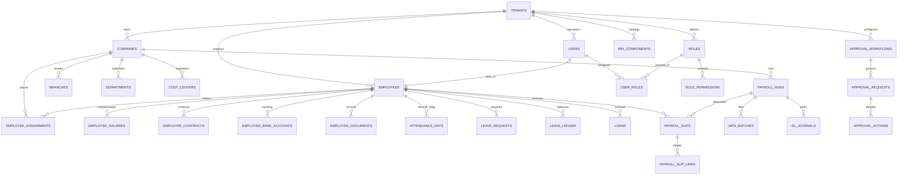

---

## 2. Domain 1: Tenancy, Identity, Platform & RBAC

Handles multi-tenant account isolation, platform operators, user authentication, sessions, single-use security tokens, and fine-grained scoped RBAC.

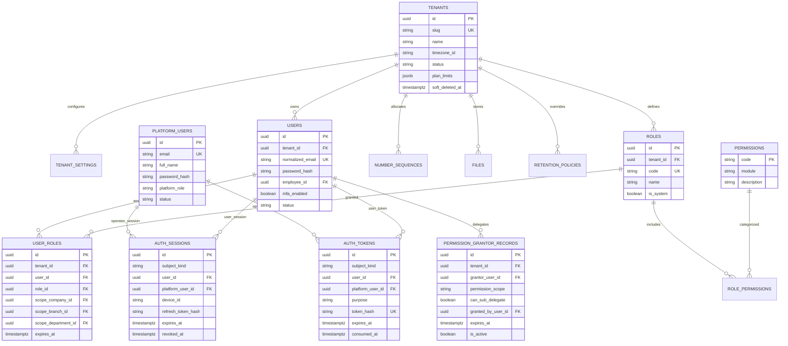

---

## 3. Domain 2: Organization Hierarchy & Legal Entities

Covers legal entities (MOL establishments), branches, hierarchical departments, cost centers, designations, grades, and company-level pay policies.

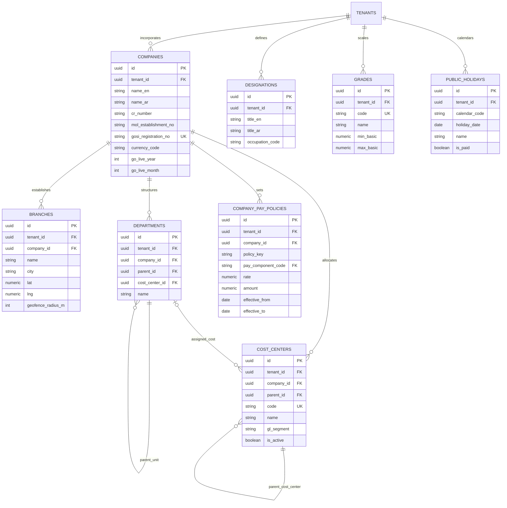

---

## 4. Domain 3: Workforce, Assignments, Salaries & Contracts

Models employee profile facts, effective-dated placements, compensation structures, labour contracts, bank accounts (IBAN), and document attachments.

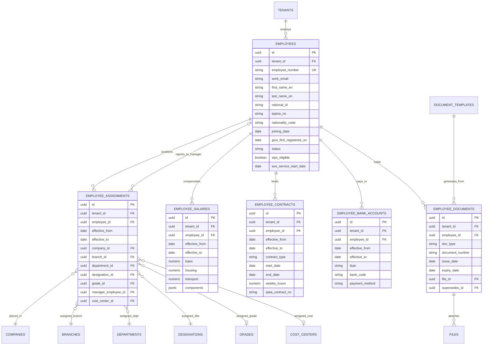

---

## 5. Domain 4: Payroll Engine & Statutory Rules

Governs monthly payroll calculation, wage snapshots, component itemization, variable inputs (arrears/overtime/deductions), statutory GOSI rules, and validation blockers.

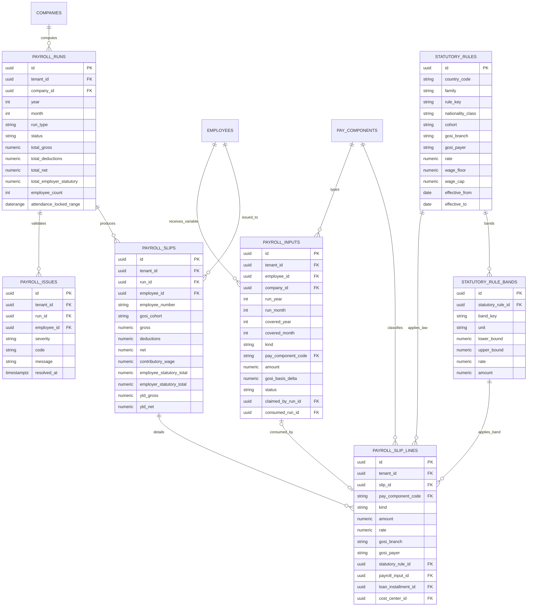

---

## 6. Domain 5: Wages Protection System (WPS) & GL Accounting

Handles KSA central bank / MHRSD compliant SIF file generation, bank acknowledgements, balanced double-entry ERP journal posting, and accounting period locks.

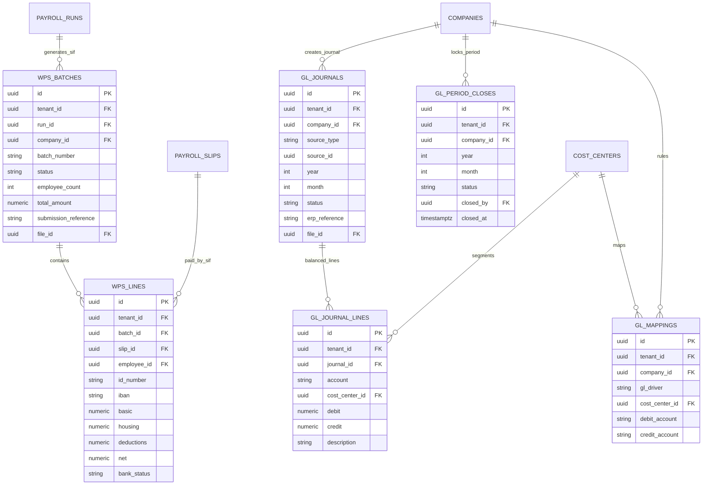

---

## 7. Domain 6: Time, Attendance, Overtime & Timesheets

Tracks biometric device ingestion, raw punches, calculated daily attendance, overtime claims with statutory rates, employee timesheets, and reconciliation variance.

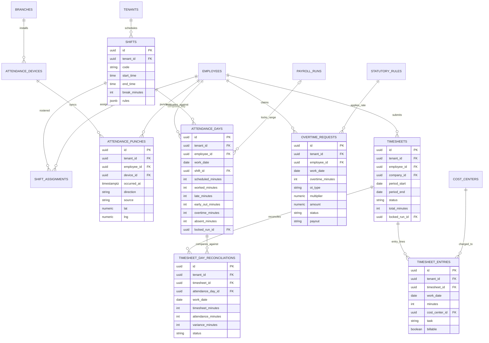

---

## 8. Domain 7: Leave Management & Ledger Transactions

Manages statutory (Saudi Labour Law Art. 109–117) and company leave policies, request approval flows, and an append-only transaction ledger.

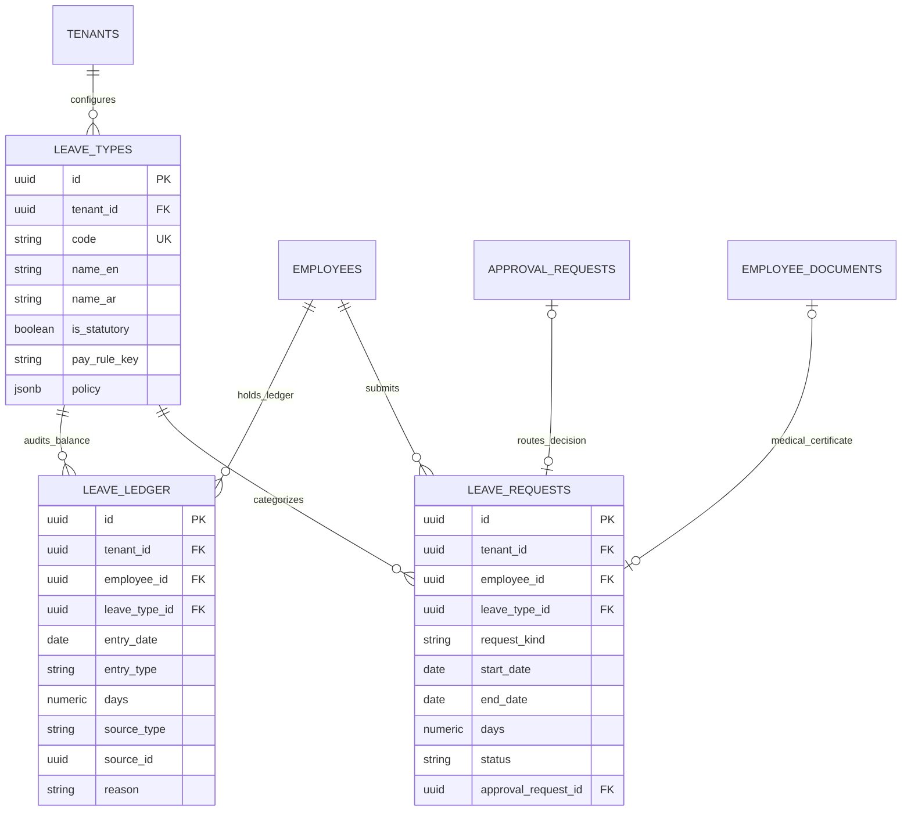

---

## 9. Domain 8: Loans, Advances & End of Service (EOS)

Governs employee loans, installment amortization, Article 84/85/87 End of Service gratuity computations, and final settlement payment lines.

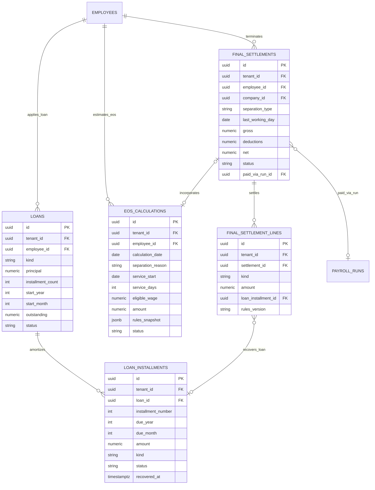

---

## 10. Domain 9: Statutory Compliance (GOSI & Nitaqat)

Models GOSI registration records at the establishment level, monthly return filing with branch-level reconciliation, and point-in-time Nitaqat Saudization quotas.

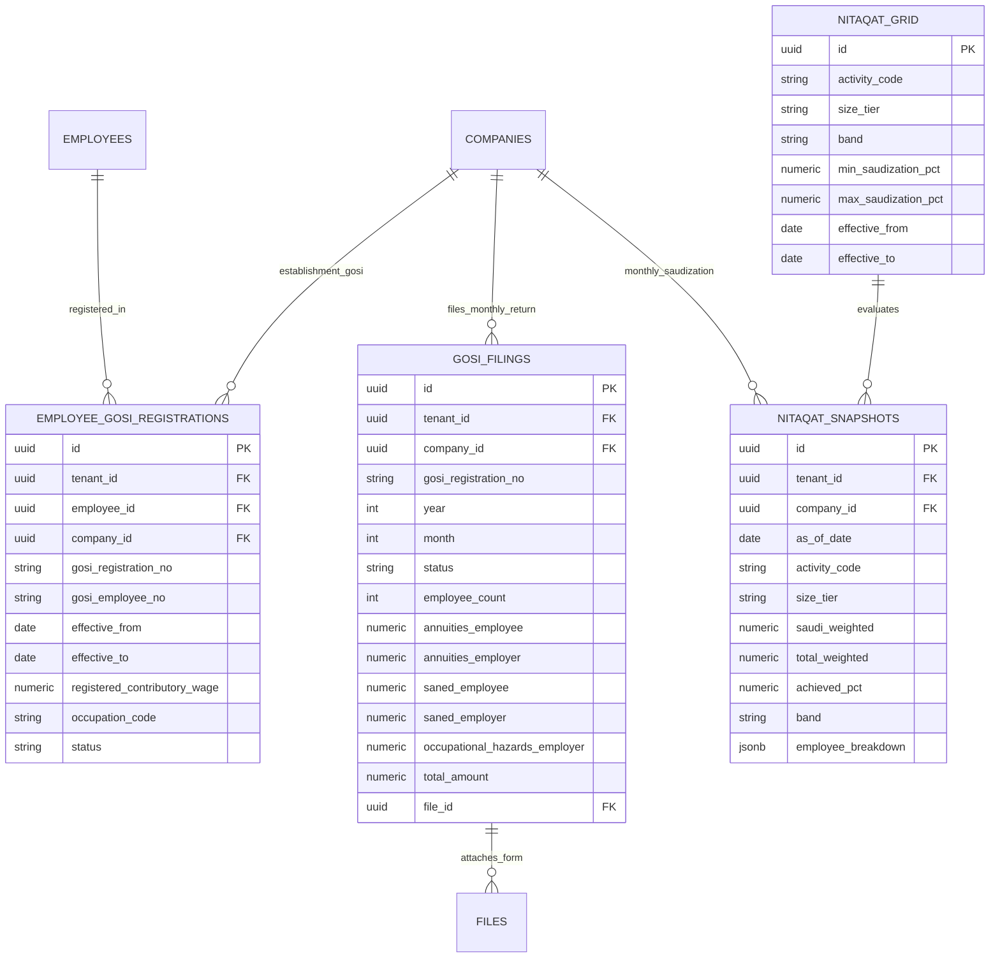

---

## 11. Domain 10: Approvals, Notifications, Audit & Background Jobs

Covers generic approval workflows, user inboxes and multi-channel notifications, async background jobs, and PDPL-compliant tamper-evident audit logs.

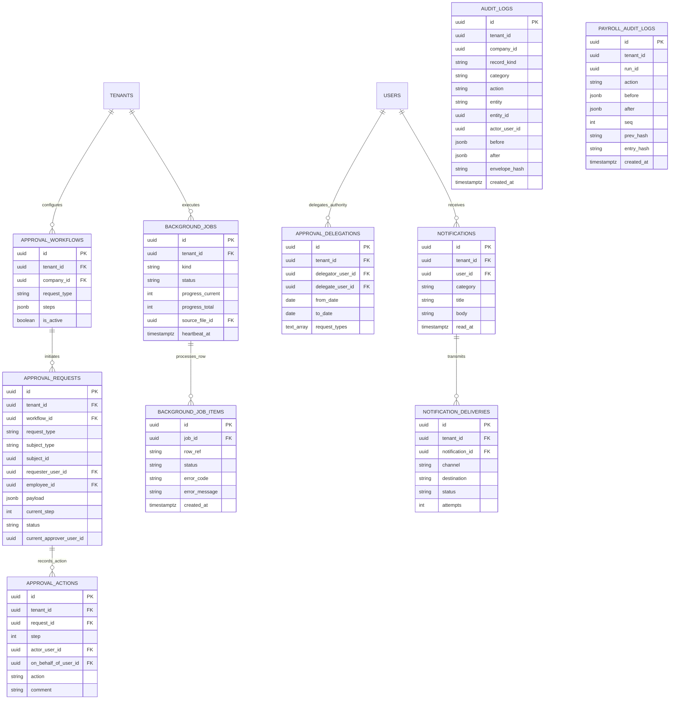

---

## 12. Architectural Conventions

| Concept | Implementation Standard | Guarantees |
| :--- | :--- | :--- |
| **Primary Keys** | UUIDv7 across every table, client-side generated | Monotonic index locality, zero lock contention |
| **Tenant Isolation** | `tenant_id uuid NOT NULL` on every tenant table | Universal `UNIQUE(tenant_id, id)` and composite foreign keys |
| **Units** | Whole integer minutes (`_minutes`) for all time/attendance durations; Decimal days (`days`) for leaves | Precise subtraction without rounding or conversion errors |
| **Effective Dating** | `effective_from` & `effective_to` with PostgreSQL GIST EXCLUDE | Mathematical prevention of overlapping date ranges |
| **Tamper Evidence** | Unchained Merkle checkpoints (`audit_logs`) + Row-chained SHA-256 (`payroll_audit_logs`) | PDPL erasure compliant with verifiable history integrity |
| **Delete Actions** | `RESTRICT` on financial/statutory rows; `CASCADE` on compositional lines | Prevents accidental orphan records or financial erasure |
