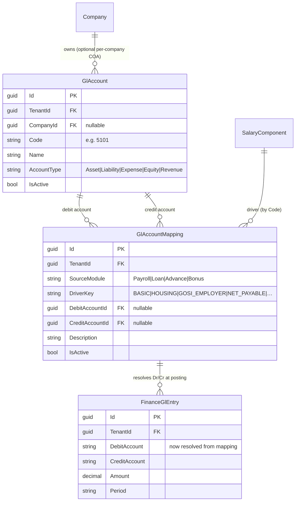
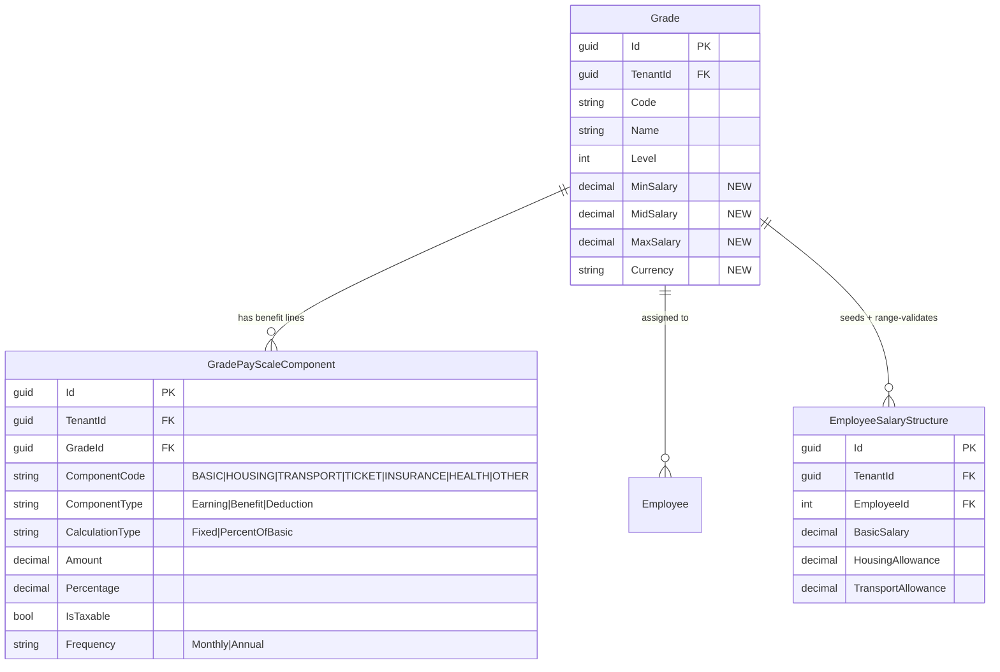

# Payroll Finance / Pay Scale / Master Data — Design & ERDs

Status: **proposal for review** (no code written yet for items 2–4). Item 1 (translation bug) is fixed.

---

## 1. Translation-service bug — ✅ FIXED

**Symptom:** the auto-translated *Name (AR)* field rendered `<g id="1"> </g>مكتب جدة:` (CAT-tool placeholder tags + stray colon).

**Root cause:** [useAutoTranslate.ts](../frontend/src/hooks/useAutoTranslate.ts) takes MyMemory's `translatedText` verbatim. MyMemory returns crowd-sourced translation-memory segments that often carry inline placeholder tags (`<g id="1">…</g>`, XLIFF/TMX markers), HTML entities, and the original label's trailing punctuation.

**Fix (single source → all modules):** added `sanitizeTranslation()` — strips `<…>` tags, decodes entities, collapses whitespace, trims edge separators, and drops MyMemory plain-text warning echoes. Applied on fetch **and** on cache-read (so the poisoned localStorage entries from testing self-heal). Covers Setup (branch/company/department), Leave, Loans, Employees — every consumer of the hook.

---

## 2. GL Account mapping (configurable, not hard-coded)

### Today (the gap)
`PayrollController.BuildPayrollGlEntries()` hard-codes account strings:
`"5101 - Employer Social Insurance Expense"`, `"2100 - Salaries Payable"`, `"1400 - Employee Loans Receivable"`, etc. `FinanceGlEntry.DebitAccount/CreditAccount` are free-text. There is **no chart of accounts and no per-component mapping** — finance cannot point payroll at their own GL codes, and codes differ per company/ERP.

### Proposal
Two new entities + a Setup screen. Payroll posting reads the mapping instead of literals (with the current literals as seeded defaults, so nothing breaks).

- **GlAccount** — the tenant's chart of accounts (or per-company).
- **GlAccountMapping** — maps a payroll *driver* (salary component code or system event like `NET_PAYABLE`, `GOSI_EMPLOYER`) to a debit and/or credit `GlAccount`.

**Frontend placement:** `Setup → Finance → GL Mapping` (Admin/Finance role). Two panels: Chart of Accounts (CRUD) + Mapping table (driver → Dr/Cr account dropdowns). Mirrors the existing Tax Policy setup pattern.

### ERD

---

## 3. Pay Scale by Grade (min/mid/max + benefits)

### Today (the gap)
`Grade` has only `Code, Name, Band, Level, IsActive`. **There are no MinSalary/MaxSalary fields** — yet the Grades CSV template/export *show* those columns and the export writes empty strings for them (faked). Benefit amounts (Basic/Housing/Transport/…) live only on `EmployeeSalaryStructure` per employee; there is no grade-level pay structure to drive or validate them.

### Proposal
- Extend **Grade** with the salary band: `MinSalary, MidSalary, MaxSalary, Currency`.
- New **GradePayScaleComponent** — default benefit breakdown per grade (Basic, Housing, Transport, Ticket, Other Allowance, Insurance, Health, …), each fixed or % of basic, taxable flag, frequency.
- On assigning an employee to a grade: seed `EmployeeSalaryStructure` from the pay scale and **validate the offered salary is within `[MinSalary, MaxSalary]`**.

**Frontend placement:** `Setup → Grades → Pay Scale` (tab/modal on the existing Grade editor): min/mid/max inputs + a component grid. (Real Min/Max columns also un-fake the Grades import template from item 1's PR.)

### ERD

---

## 4. Master Data rules — what they are + standards review

### What exists
- **MasterDataType** = a dropdown *category* (`EmploymentType`, `MaritalStatus`, `ContractType`, …). Flags: `IsSystemDefined` (undeletable), `AllowCustomValues`, `IsActive`.
- **MasterDataValue** = the options under a type (`Code, ValueEn, ValueAr, SortOrder, IsDefault, IsSystemDefined, ExtraJson`).
- CRUD at `api/admin/master-data` with audit logging; system-defined types/values can't be deleted. **Governance is sound.**

### Standards gaps (the "reconsider as per standards" part)
1. **Not enforced.** Entity fields that *should* reference master data are free-text strings — e.g. `Employee.EmploymentType/ContractType/Gender`, `Branch.CountryCode` are plain `string`, not validated against `MasterDataValue`. Master data is decorative until referencing fields validate against it.
2. **No ISO reference sets.** Country/Currency/Nationality aren't seeded from standards. Evidence: the screenshot's Country Code = **`KSA`**, which is *not* ISO — ISO-3166 alpha-2 is **`SA`** (and our cleaned templates correctly use `AE`). Country should be ISO-3166, currency ISO-4217, seeded as system master data + a dropdown, not free text.
3. **No validation metadata** per type (data type, regex, min/max) — `ExtraJson` exists but is unused for rules.
4. **No effective-dating/versioning** on values (fine for v1; note for later).

### Recommendation
(a) Seed system master-data sets for ISO Country/Currency/Nationality + the HR enums; (b) convert the worst free-text reference fields to validate against master data (dropdowns in UI, server-side validation on write); (c) optionally use `ExtraJson` for per-type validation rules.

---

## Suggested build order
1. **Pay Scale by Grade** — also un-fakes the Grades template; self-contained.
2. **GL Account mapping** — unblocks finance; depends on knowing the component/driver list from (1).
3. **Master Data standards** — cross-cutting; do after the above so the new pay-scale/GL pick-lists ride the same governance.
