# prerequisites → run → validation → maker approval → finance approval → lock → payslips → bank file → reconciliation

Recorded by the KynexOne evidence harness (`frontend/e2e/evidence/`). Every step below is one linked record: who acted, when, what they did, what the API answered, what the database said when the record was read back, and a picture of the settled screen. Steps with no picture are listed as **NO CAPTURE** with the reason — never left blank.

- Run: `2026-09-30T19-50-06-091Z` · started 2026-09-30T19:50:06.091Z · finished 2026-09-30T19:51:18.636Z
- Frontend: http://127.0.0.1:5173 · API: http://127.0.0.1:5117
- Build under test: 5c65d6a093fc97d0cbee1c0ed5114982d61904d3 · database: zayra
- Personal data: **redacted** in this copy; the unredacted originals are kept outside the repository and are matched to it by `originalSha256`

**14 steps — 14 passed, 0 failed. 13 with a verified settled-state image, 1 explicitly NO CAPTURE. 14 re-read the record after the write.**

| # | Step | Actor | Role | Record | Outcome | Image |
|---|------|-------|------|--------|---------|-------|
| 1 | Read the payroll prerequisites for the tenant before opening a run | IntelliFlow HR Manager | HR Manager | Tenant payroll readiness `intelliflow` | pass | [`img/01-prerequisites.jpg`](img/01-prerequisites.jpg) |
| 2 | REFUSAL — try to activate a KSA expat who has no GOSI reference and no Iqama number, twice: once stating the country, once leaving it to the employing company | IntelliFlow Administrator | Admin | Employee (Draft, refused activation) `44` | pass | **NO CAPTURE** — Deliberately so: this refusal was driven through the API, so there is no screen of it to photograph; the 422 bodies recorded below are the whole of the evidence. A picture of the employee list here would show a screen that has nothing to do with the refusal, which is exactly the substitution this harness exists to prevent. The UI path for the same refusal is listed under Not run. |
| 3 | Create the payroll run for the first period that does not have one | IntelliFlow Administrator | Admin | PayrollRun `2dbe8b64-ea51-41f8-a8d8-64981d53d86a` | pass | [`img/03-run-created.jpg`](img/03-run-created.jpg) |
| 4 | Process the run so every employee on it gets a calculated salary slip | IntelliFlow Administrator | Admin | PayrollRun `2dbe8b64-ea51-41f8-a8d8-64981d53d86a` | pass | [`img/04-run-processed.jpg`](img/04-run-processed.jpg) |
| 5 | Run payroll validation on the processed run and read every finding | IntelliFlow HR Manager | HR Manager | PayrollRun `2dbe8b64-ea51-41f8-a8d8-64981d53d86a` | pass | [`img/05-validation.jpg`](img/05-validation.jpg) |
| 6 | The HR Manager (maker) approves the run and sends it to Finance | IntelliFlow HR Manager | HR Manager | PayrollRun `2dbe8b64-ea51-41f8-a8d8-64981d53d86a` | pass | [`img/06-maker-approval.jpg`](img/06-maker-approval.jpg) |
| 7 | REFUSAL — the maker tries to approve a second time and complete the run alone | IntelliFlow HR Manager | HR Manager | PayrollRun `2dbe8b64-ea51-41f8-a8d8-64981d53d86a` | pass | [`img/07-refusal-maker-cannot-finalise.jpg`](img/07-refusal-maker-cannot-finalise.jpg) |
| 8 | The Finance Approver — a different authorised person — gives the final approval | IntelliFlow Finance Approver | Finance Approver | PayrollRun `2dbe8b64-ea51-41f8-a8d8-64981d53d86a` | pass | [`img/08-finance-approval.jpg`](img/08-finance-approval.jpg) |
| 9 | REFUSAL — open the bank export while the run is Approved but not yet Locked | IntelliFlow Administrator | Admin | PayrollRun `2dbe8b64-ea51-41f8-a8d8-64981d53d86a` | pass | [`img/09-refusal-batch-before-lock.jpg`](img/09-refusal-batch-before-lock.jpg) |
| 10 | The Finance Approver locks the approved run | IntelliFlow Finance Approver | Finance Approver | PayrollRun `2dbe8b64-ea51-41f8-a8d8-64981d53d86a` | pass | [`img/10-run-locked.jpg`](img/10-run-locked.jpg) |
| 11 | Generate the payslips for the locked run | IntelliFlow HR Manager | HR Manager | PayrollRun `2dbe8b64-ea51-41f8-a8d8-64981d53d86a` | pass | [`img/11-payslips.jpg`](img/11-payslips.jpg) |
| 12 | Create the payment batch now that the run is locked | IntelliFlow Administrator | Admin | PayrollPaymentBatch `007f022d-07b8-42ad-9ef1-6b8aaf6449d2` | pass | [`img/12-payment-batch.jpg`](img/12-payment-batch.jpg) |
| 13 | Generate the WPS/SIF bank file (generation only — this must not pay anybody) | IntelliFlow Administrator | Admin | PayrollPaymentBatch `007f022d-07b8-42ad-9ef1-6b8aaf6449d2` | pass | [`img/13-bank-export-generation-only.jpg`](img/13-bank-export-generation-only.jpg) |
| 14 | Reconcile the displayed totals against the source records | IntelliFlow Finance Approver | Finance Approver | PayrollRun `2dbe8b64-ea51-41f8-a8d8-64981d53d86a` | pass | [`img/14-reconciliation.jpg`](img/14-reconciliation.jpg) |

## 1. Read the payroll prerequisites for the tenant before opening a run

- **Actor** — IntelliFlow HR Manager (HR Manager), `hr*******@intelliflow.com`, tenant `intelliflow`, scope `group`
- **When (UTC)** — 2026-09-30T19:50:53.693Z (2150 ms)
- **Business record** — Tenant payroll readiness `intelliflow`
- **Expected** — The payroll dashboard states how many ACTIVE employees were checked against salary assignments, payroll profiles, IBANs and statutory readiness, and names every remaining gap.
- **Observed** — The prerequisites panel reports 14 active employees checked.
- **API**
  - `GET /api/help-texts` → **200** (0 ms)
  - `GET /api/auth/me` → **200** (0 ms)
  - `GET /api/notifications` → **200** (0 ms)
  - `GET /api/tenant-admin/localization` → **200** (0 ms)
  - `GET /api/features/modules` → **200** (0 ms)
  - `GET /api/features/disabled-keys` → **200** (0 ms)
  - `GET /api/payroll/companies` → **200** (0 ms)
  - `GET /api/payroll/reports/summary` → **200** (0 ms)
  - `GET /api/payroll/overview?year=2026&month=9` → **200** (0 ms)
  - `GET /api/payroll/readiness?year=2026&month=9` → **200** (0 ms)
  - `GET /api/payroll/readiness?year=2026&month=9` → **200** (40 ms)
- **Persisted (fresh GET)** — totalActiveEmployees=`14`, employeesWithSalary=`14`, salaryCoveragePercent=`100`, isReadyForProcessing=`false`
- **Screen assertion** — the settled screen showed /Checked for \d+ active employees/
- **Image** — `img/01-prerequisites.jpg`, sha256 `0039a41f0875fb5a6079b52d96d7114a929c616243fbda36ea637e423e9ce2dc` (original sha256 `32e67819ad1f525b2382afeaacf27990044193691c579bff09ec80219864e9d1`, 105848 bytes)
- **Settled** — after 453 ms; waited out 0 request(s) and 0 loading indicator(s); 1 node(s) redacted

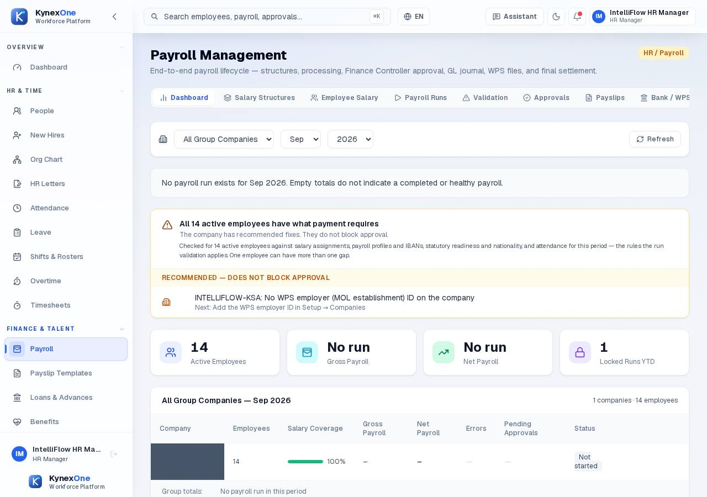

## 2. REFUSAL — try to activate a KSA expat who has no GOSI reference and no Iqama number, twice: once stating the country, once leaving it to the employing company

- **Actor** — IntelliFlow Administrator (Admin), `ad***@intelliflow.com`, tenant `intelliflow`, scope `group`
- **When (UTC)** — 2026-09-30T19:50:55.843Z (297 ms)
- **Business record** — Employee (Draft, refused activation) `44`
- **Expected** — Both activations are refused with the same structured 422 naming the missing statutory data, and both employees stay Draft. An employee who cannot lawfully be paid must never join a payroll population — and whether the create request happened to name the country must make no difference, because the employing legal entity already decides it.
- **Observed** — Draft employee #44 (SA, Indian national) created; activation refused with HTTP 422 employee_not_activatable. Activate-blocking: IqamaNumber. Pay-blocking: GosiReference, IqamaExpiry. Draft employee #45 — same KSA legal entity, same Indian nationality, same absent Iqama and GOSI reference, but created WITHOUT any complianceRecords — was stored with countryCode "SA" (derived from the employing company) and its activation was refused with HTTP 422 employee_not_activatable, blocking IqamaNumber. The two calls differ only by that omitted field and reach the same refusal.
- **API**
  - `GET /api/companies?page=1&pageSize=10` → **200** (20 ms)
  - `POST /api/employees` → **201** (68 ms)
  - `POST /api/employees/44/activate` → **422** (45 ms) — {"error":"employee_not_activatable","employeeId":44,"message":"Cannot activate this employee — 1 required detail(s) missing.","policy":{"countryCode":"SA","tier":"certified","sources":["floor","tenant","company"]},"progr
  - `POST /api/employees` → **201** (61 ms)
  - `POST /api/employees/45/activate` → **422** (30 ms) — {"error":"employee_not_activatable","employeeId":45,"message":"Cannot activate this employee — 1 required detail(s) missing.","policy":{"countryCode":"SA","tier":"certified","sources":["floor","tenant","company"]},"progr
  - `GET /api/employees/44` → **200** (31 ms)
  - `GET /api/employees/45` → **200** (25 ms)
- **Persisted (fresh GETs of both employees — a refused activation must leave each one Draft, and the employee created without a stated country must hold the employing company's country)** — employeeId=`44`, status=`"Draft"`, activated=`false`, employeeIdWithNoStatedCountry=`45`, statusWithNoStatedCountry=`"Draft"`, countryCodeWithNoStatedCountry=`"SA"`, activatedWithNoStatedCountry=`false`
- **Image** — **NO CAPTURE.** Deliberately so: this refusal was driven through the API, so there is no screen of it to photograph; the 422 bodies recorded below are the whole of the evidence. A picture of the employee list here would show a screen that has nothing to do with the refusal, which is exactly the substitution this harness exists to prevent. The UI path for the same refusal is listed under Not run.

## 3. Create the payroll run for the first period that does not have one

- **Actor** — IntelliFlow Administrator (Admin), `ad***@intelliflow.com`, tenant `intelliflow`, scope `group`
- **When (UTC)** — 2026-09-30T19:50:56.140Z (2247 ms)
- **Business record** — PayrollRun `2dbe8b64-ea51-41f8-a8d8-64981d53d86a`
- **Expected** — A new run exists in Draft for that period, and the list renders every run the API returned.
- **Observed** — Run for Sep 2026 created in Draft as 2dbe8b64-ea51-41f8-a8d8-64981d53d86a.
- **API**
  - `GET /api/help-texts` → **200** (0 ms)
  - `GET /api/auth/me` → **200** (0 ms)
  - `GET /api/features/disabled-keys` → **200** (0 ms)
  - `GET /api/tenant-admin/localization` → **200** (0 ms)
  - `GET /api/features/modules` → **200** (0 ms)
  - `GET /api/notifications` → **200** (0 ms)
  - `GET /api/payroll/companies` → **200** (0 ms)
  - `GET /api/ai/insights?acknowledged=false&pageSize=5` → **200** (0 ms)
  - `GET /api/payroll/reports/summary` → **200** (0 ms)
  - `GET /api/payroll/overview?year=2026&month=9` → **200** (0 ms)
  - `GET /api/payroll/readiness?year=2026&month=9` → **200** (0 ms)
  - `GET /api/payroll/runs?page=1&pageSize=100` → **200** (0 ms)
  - …and 5 more, in `manifest.json`
- **Persisted (fresh GET)** — runId=`"2dbe8b64-ea51-41f8-a8d8-64981d53d86a"`, status=`"Draft"`, employeeCount=`0`
- **Screen assertion** — the settled screen showed /Draft/
- **Image** — `img/03-run-created.jpg`, sha256 `b589ff4cc15e1d5255a3efcf79ed6f9dcaf785807059ce80615894e5012b9a1b` (original sha256 `b589ff4cc15e1d5255a3efcf79ed6f9dcaf785807059ce80615894e5012b9a1b`, 64817 bytes)
- **Settled** — after 434 ms; waited out 0 request(s) and 0 loading indicator(s); 0 node(s) redacted

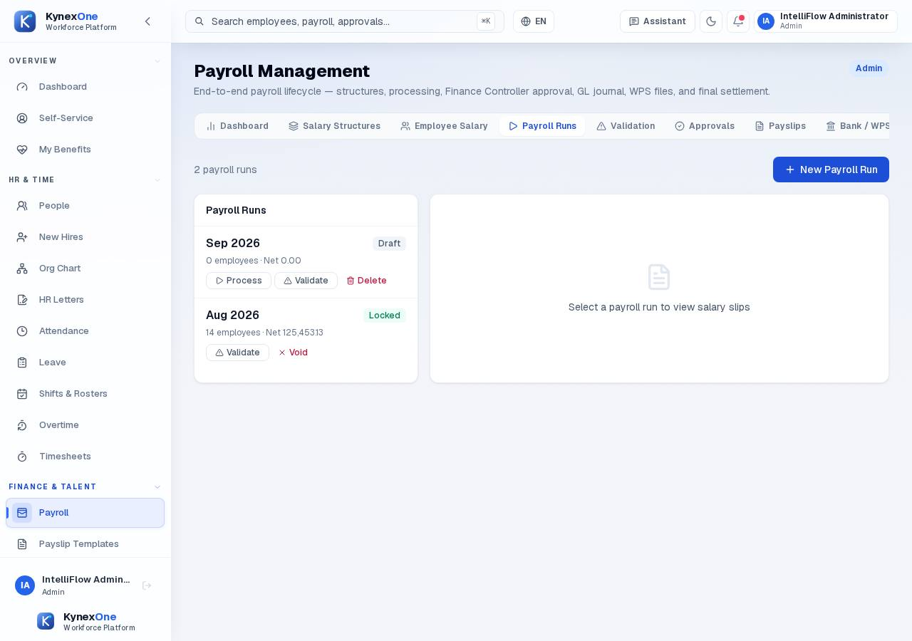

## 4. Process the run so every employee on it gets a calculated salary slip

- **Actor** — IntelliFlow Administrator (Admin), `ad***@intelliflow.com`, tenant `intelliflow`, scope `group`
- **When (UTC)** — 2026-09-30T19:50:58.387Z (1553 ms)
- **Business record** — PayrollRun `2dbe8b64-ea51-41f8-a8d8-64981d53d86a`
- **Expected** — The run leaves Draft for Processed and carries a non-zero employee count and net-pay total.
- **Observed** — 14 employees, gross 138250.00, net 119730.47.
- **API**
  - `POST /api/payroll/runs/2dbe8b64-ea51-41f8-a8d8-64981d53d86a/process` → **200** (0 ms)
  - `GET /api/payroll/runs?pageSize=100` → **200** (19 ms)
- **Persisted (fresh GET)** — status=`"Processed"`, employeeCount=`14`, totalGrossSalary=`138250`, totalNetSalary=`119730.47`
- **Screen assertion** — the settled screen showed /Processed/
- **Image** — `img/04-run-processed.jpg`, sha256 `2e4508acf0fd1c93420c2c5b79b897f510b7b317a7a5ce6d3a69ad15b9b594d9` (original sha256 `2e4508acf0fd1c93420c2c5b79b897f510b7b317a7a5ce6d3a69ad15b9b594d9`, 65204 bytes)
- **Settled** — after 435 ms; waited out 0 request(s) and 0 loading indicator(s); 0 node(s) redacted

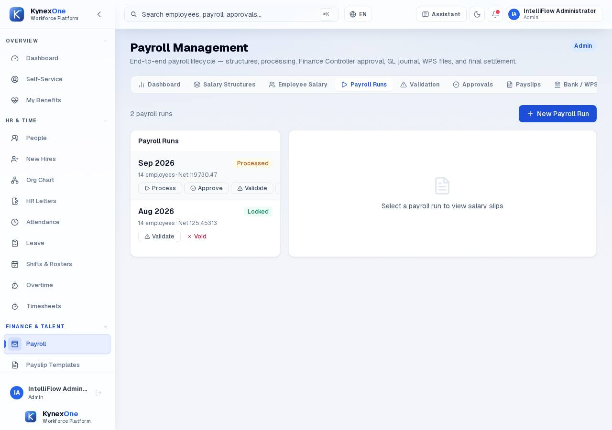

## 5. Run payroll validation on the processed run and read every finding

- **Actor** — IntelliFlow HR Manager (HR Manager), `hr*******@intelliflow.com`, tenant `intelliflow`, scope `group`
- **When (UTC)** — 2026-09-30T19:50:59.940Z (2078 ms)
- **Business record** — PayrollRun `2dbe8b64-ea51-41f8-a8d8-64981d53d86a`
- **Expected** — Validation completes with ZERO errors, and every warning it does return is one this story can explain by code — an unexplained warning fails the step rather than being counted and carried into approval.
- **Observed** — Validation returned 29 finding(s): 0 error(s), 29 warning(s); codes: GOSI_COHORT_NOT_RECORDED, WARN_ARREARS_LOOKBACK_TRUNCATED, WARN_GOSI_RATES_REQUIRE_SIGNOFF.
- **API**
  - `GET /api/help-texts` → **200** (0 ms)
  - `GET /api/auth/me` → **200** (0 ms)
  - `GET /api/tenant-admin/localization` → **200** (0 ms)
  - `GET /api/notifications` → **200** (0 ms)
  - `GET /api/features/disabled-keys` → **200** (0 ms)
  - `GET /api/features/modules` → **200** (0 ms)
  - `GET /api/payroll/reports/summary` → **200** (0 ms)
  - `GET /api/payroll/companies` → **200** (0 ms)
  - `GET /api/payroll/overview?year=2026&month=9` → **200** (0 ms)
  - `GET /api/payroll/readiness?year=2026&month=9` → **200** (0 ms)
  - `GET /api/payroll/runs?page=1&pageSize=100` → **200** (0 ms)
  - `GET /api/payroll/runs/2dbe8b64-ea51-41f8-a8d8-64981d53d86a/validate` → **200** (0 ms)
  - …and 4 more, in `manifest.json`
- **Persisted (fresh GET of the saved validation results)** — findings=`14`, errors=`0`, warnings=`14`, warningCodes=`["GOSI_COHORT_NOT_RECORDED"]`, warningsExplained=`{"GOSI_COHORT_NOT_RECORDED":"14× — The employee has no GOSI first-registration date, so the engine cannot tell which contribution schedule applies and computes on the pre-3-July-2024 one. It is a WARNING and not an error by design: the pre-2024 schedule is the correct answer for everyone hired before that date, and the date is recorded on the employee's Payroll tab once known. The fixture employees are provisioned without it, so this fires once per employee and is expected here. The related GOSI_NEW_ENTRANT_SCHEDULE_NOT_MODELLED code is an ERROR and would block approval; it does not appear on this run, and the step asserts zero errors."}`
- **Image** — `img/05-validation.jpg`, sha256 `5af5122c337f45355fd39709476be504cbcb5c853b6a1ab56ea04e979212567a` (original sha256 `5af5122c337f45355fd39709476be504cbcb5c853b6a1ab56ea04e979212567a`, 154959 bytes)
- **Settled** — after 439 ms; waited out 0 request(s) and 0 loading indicator(s); 0 node(s) redacted

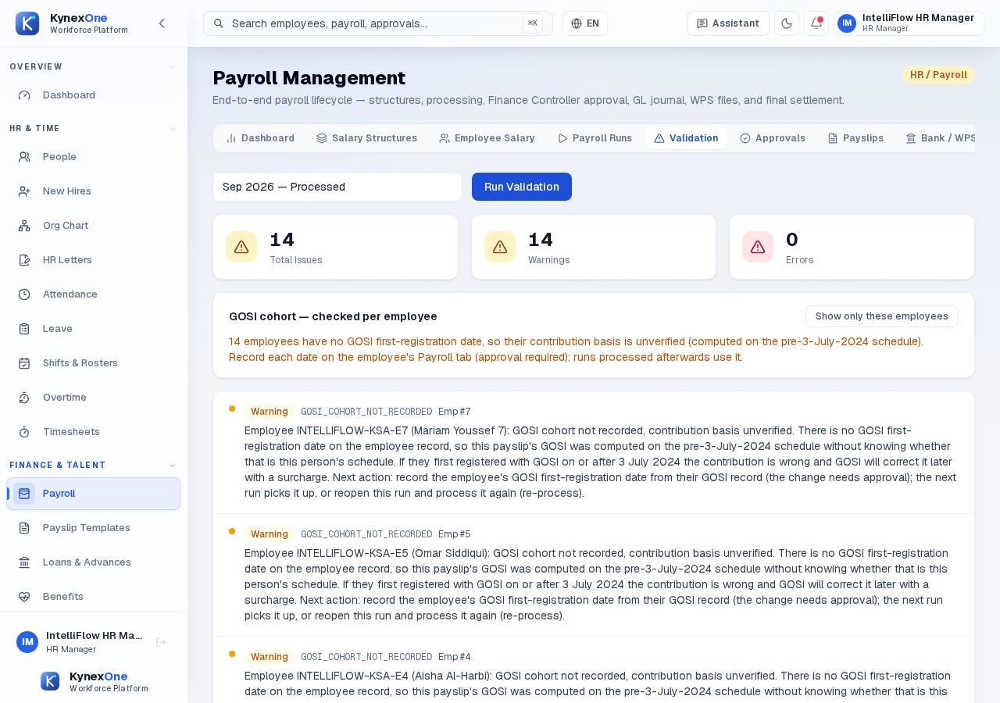

## 6. The HR Manager (maker) approves the run and sends it to Finance

- **Actor** — IntelliFlow HR Manager (HR Manager), `hr*******@intelliflow.com`, tenant `intelliflow`, scope `group`
- **When (UTC)** — 2026-09-30T19:51:02.018Z (1668 ms)
- **Business record** — PayrollRun `2dbe8b64-ea51-41f8-a8d8-64981d53d86a`
- **Expected** — The run moves to Pending Finance Review, and the approval chain records the maker step. The maker is told, on screen, that their approval is not the final one.
- **Observed** — Screen and API agree: 14 employees, gross SAR 138,250.00, net SAR 119,730.47. The run is now Pending Finance Review.
- **API**
  - `GET /api/payroll/runs?page=1&pageSize=100` → **200** (0 ms)
  - `GET /api/payroll/companies` → **200** (0 ms)
  - `GET /api/payroll/runs/2dbe8b64-ea51-41f8-a8d8-64981d53d86a/approvals` → **200** (0 ms)
  - `GET /api/payroll/runs/2dbe8b64-ea51-41f8-a8d8-64981d53d86a/validation-overrides` → **200** (0 ms)
  - `GET /api/payroll/runs/2dbe8b64-ea51-41f8-a8d8-64981d53d86a/population` → **200** (0 ms)
  - `POST /api/payroll/runs/2dbe8b64-ea51-41f8-a8d8-64981d53d86a/approve` → **200** (0 ms)
  - `GET /api/payroll/runs?page=1&pageSize=100` → **200** (0 ms)
  - `GET /api/payroll/runs/2dbe8b64-ea51-41f8-a8d8-64981d53d86a/validation-overrides` → **200** (0 ms)
  - `GET /api/payroll/runs/2dbe8b64-ea51-41f8-a8d8-64981d53d86a/approvals` → **200** (0 ms)
  - `GET /api/payroll/runs/2dbe8b64-ea51-41f8-a8d8-64981d53d86a/population` → **200** (0 ms)
  - `GET /api/payroll/runs?pageSize=100` → **200** (18 ms)
- **Persisted (fresh GET)** — status=`"PendingFinanceReview"`
- **Screen assertion** — the settled screen showed Awaiting Finance Controller approval.
- **Image** — `img/06-maker-approval.jpg`, sha256 `961256777aa2d439f35c2822c70c7ef55764dd62f00a2cd7a20e655a09f3408b` (original sha256 `961256777aa2d439f35c2822c70c7ef55764dd62f00a2cd7a20e655a09f3408b`, 76441 bytes)
- **Settled** — after 431 ms; waited out 0 request(s) and 0 loading indicator(s); 0 node(s) redacted

## 7. REFUSAL — the maker tries to approve a second time and complete the run alone

- **Actor** — IntelliFlow HR Manager (HR Manager), `hr*******@intelliflow.com`, tenant `intelliflow`, scope `group`
- **When (UTC)** — 2026-09-30T19:51:03.686Z (1215 ms)
- **Business record** — PayrollRun `2dbe8b64-ea51-41f8-a8d8-64981d53d86a`
- **Expected** — No approval control survives on the run the maker already signed, the API refuses a second approval with HTTP 400, and — the part that matters — the run does not move.
- **Observed** — Three approval controls absent from the maker's card; the API answered HTTP 400: {"message":"You cannot approve this run at its current stage."}
- **API**
  - `POST /api/payroll/runs/2dbe8b64-ea51-41f8-a8d8-64981d53d86a/approve` → **400** (20 ms) — {"message":"You cannot approve this run at its current stage."}
  - `GET /api/payroll/runs?pageSize=100` → **200** (17 ms)
- **Persisted (fresh GET)** — status=`"PendingFinanceReview"`, unchanged=`true`
- **Screen assertion** — the settled screen showed Awaiting Finance Controller approval.
- **Image** — `img/07-refusal-maker-cannot-finalise.jpg`, sha256 `961256777aa2d439f35c2822c70c7ef55764dd62f00a2cd7a20e655a09f3408b` (original sha256 `961256777aa2d439f35c2822c70c7ef55764dd62f00a2cd7a20e655a09f3408b`, 76441 bytes)
- **Settled** — after 432 ms; waited out 0 request(s) and 0 loading indicator(s); 0 node(s) redacted

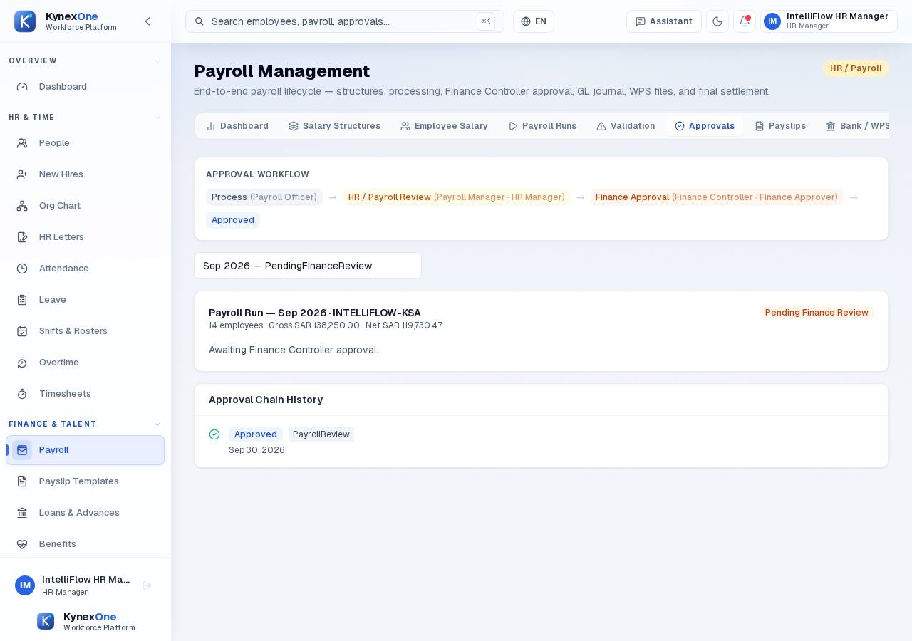

## 8. The Finance Approver — a different authorised person — gives the final approval

- **Actor** — IntelliFlow Finance Approver (Finance Approver), `fi*****@intelliflow.com`, tenant `intelliflow`, scope `group`
- **When (UTC)** — 2026-09-30T19:51:04.901Z (2102 ms)
- **Business record** — PayrollRun `2dbe8b64-ea51-41f8-a8d8-64981d53d86a`
- **Expected** — The run reaches Approved, reads as ready to lock, and the approval chain holds BOTH the maker step and the finance step, signed by two different people.
- **Observed** — Approval chain: FinanceReview → PayrollReview, signed by 2 distinct users.
- **API**
  - `GET /api/help-texts` → **200** (0 ms)
  - `GET /api/auth/me` → **200** (0 ms)
  - `GET /api/features/disabled-keys` → **200** (0 ms)
  - `GET /api/tenant-admin/localization` → **200** (0 ms)
  - `GET /api/features/modules` → **200** (0 ms)
  - `GET /api/notifications` → **200** (0 ms)
  - `GET /api/payroll/companies` → **200** (0 ms)
  - `GET /api/payroll/reports/summary` → **200** (0 ms)
  - `GET /api/payroll/overview?year=2026&month=9` → **200** (0 ms)
  - `GET /api/payroll/readiness?year=2026&month=9` → **200** (0 ms)
  - `GET /api/payroll/companies` → **200** (0 ms)
  - `GET /api/payroll/runs?page=1&pageSize=100` → **200** (0 ms)
  - …and 11 more, in `manifest.json`
- **Persisted (fresh GET)** — status=`"Approved"`, approvalLevels=`["FinanceReview:Approved","PayrollReview:Approved"]`, distinctApprovers=`2`
- **Screen assertion** — the settled screen showed Payroll run has been approved and is ready to lock.
- **Image** — `img/08-finance-approval.jpg`, sha256 `4461543154a2ec450efbf51f35b7412102c40aabb20da75d0d0533dea236c8d0` (original sha256 `4461543154a2ec450efbf51f35b7412102c40aabb20da75d0d0533dea236c8d0`, 78997 bytes)
- **Settled** — after 428 ms; waited out 0 request(s) and 0 loading indicator(s); 0 node(s) redacted

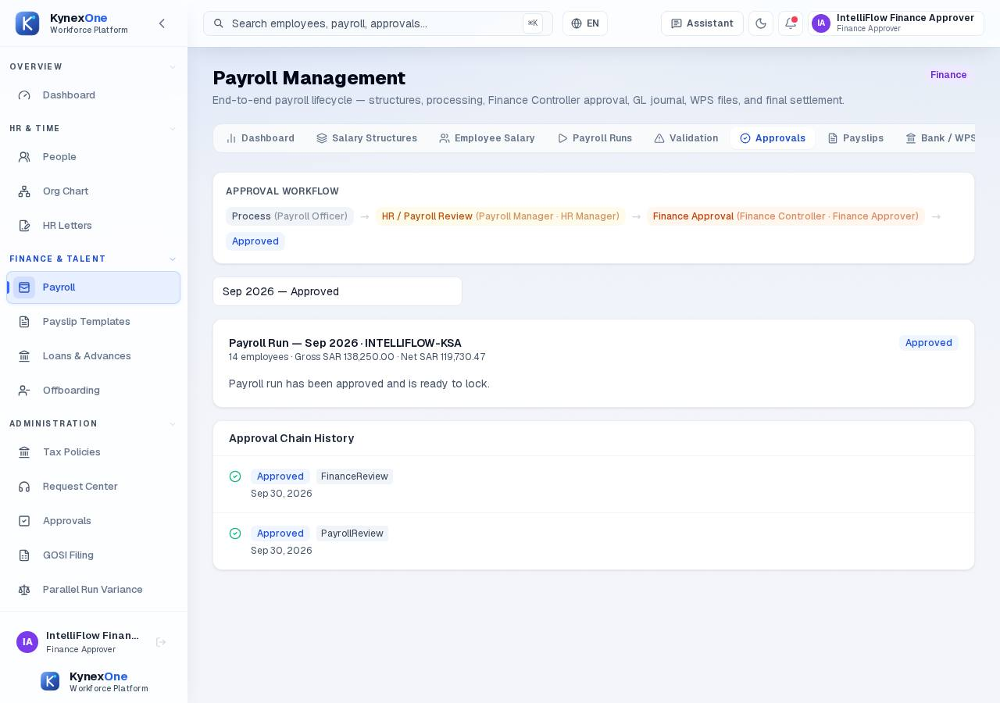

## 9. REFUSAL — open the bank export while the run is Approved but not yet Locked

- **Actor** — IntelliFlow Administrator (Admin), `ad***@intelliflow.com`, tenant `intelliflow`, scope `group`
- **When (UTC)** — 2026-09-30T19:51:07.003Z (1904 ms)
- **Business record** — PayrollRun `2dbe8b64-ea51-41f8-a8d8-64981d53d86a`
- **Expected** — Create Payment Batch is disabled, and the screen says why, naming the run's actual current status rather than a generic message. No batch exists.
- **Observed** — Create Payment Batch is disabled and the screen states "This run is Approved." — the lock, not the approval, is the gate.
- **API**
  - `GET /api/help-texts` → **200** (0 ms)
  - `GET /api/auth/me` → **200** (0 ms)
  - `GET /api/features/disabled-keys` → **200** (0 ms)
  - `GET /api/features/modules` → **200** (0 ms)
  - `GET /api/tenant-admin/localization` → **200** (0 ms)
  - `GET /api/notifications` → **200** (0 ms)
  - `GET /api/payroll/companies` → **200** (0 ms)
  - `GET /api/payroll/reports/summary` → **200** (0 ms)
  - `GET /api/ai/insights?acknowledged=false&pageSize=5` → **200** (0 ms)
  - `GET /api/payroll/overview?year=2026&month=9` → **200** (0 ms)
  - `GET /api/payroll/readiness?year=2026&month=9` → **200** (0 ms)
  - `GET /api/payroll/runs?page=1&pageSize=100` → **200** (0 ms)
  - …and 3 more, in `manifest.json`
- **Persisted (fresh GET of the run's payment batches — none may exist yet)** — paymentBatchesForThisRun=`0`, runStatusAtRefusal=`"Approved"`
- **Screen assertion** — the settled screen showed /A payment batch can only be created once the run is/
- **Image** — `img/09-refusal-batch-before-lock.jpg`, sha256 `c88a338c8f42e751f541de1cc258c6ef27ec8bdfa8a1c2c61a53c93067a35ef0` (original sha256 `c88a338c8f42e751f541de1cc258c6ef27ec8bdfa8a1c2c61a53c93067a35ef0`, 68292 bytes)
- **Settled** — after 433 ms; waited out 0 request(s) and 0 loading indicator(s); 0 node(s) redacted

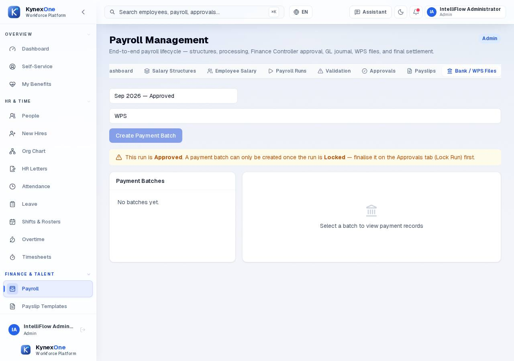

## 10. The Finance Approver locks the approved run

- **Actor** — IntelliFlow Finance Approver (Finance Approver), `fi*****@intelliflow.com`, tenant `intelliflow`, scope `group`
- **When (UTC)** — 2026-09-30T19:51:08.907Z (1429 ms)
- **Business record** — PayrollRun `2dbe8b64-ea51-41f8-a8d8-64981d53d86a`
- **Expected** — The run reaches Locked, carries a lock timestamp, and offers no further lifecycle control.
- **Observed** — The run is Locked and exposes no Lock or Process control.
- **API**
  - `GET /api/payroll/companies` → **200** (0 ms)
  - `GET /api/payroll/runs?page=1&pageSize=100` → **200** (0 ms)
  - `POST /api/payroll/runs/2dbe8b64-ea51-41f8-a8d8-64981d53d86a/lock` → **200** (0 ms)
  - `GET /api/payroll/runs?pageSize=100` → **200** (17 ms)
- **Persisted (fresh GET)** — status=`"Locked"`, lockedAtUtc=`"2026-09-30T19:51:09.080149Z"`
- **Screen assertion** — the settled screen showed /Locked/
- **Image** — `img/10-run-locked.jpg`, sha256 `a9fae09d6986a11e6f613d86560f6b94415fd9cab1f3f6413ec081170ef300cb` (original sha256 `a9fae09d6986a11e6f613d86560f6b94415fd9cab1f3f6413ec081170ef300cb`, 65677 bytes)
- **Settled** — after 428 ms; waited out 0 request(s) and 0 loading indicator(s); 0 node(s) redacted

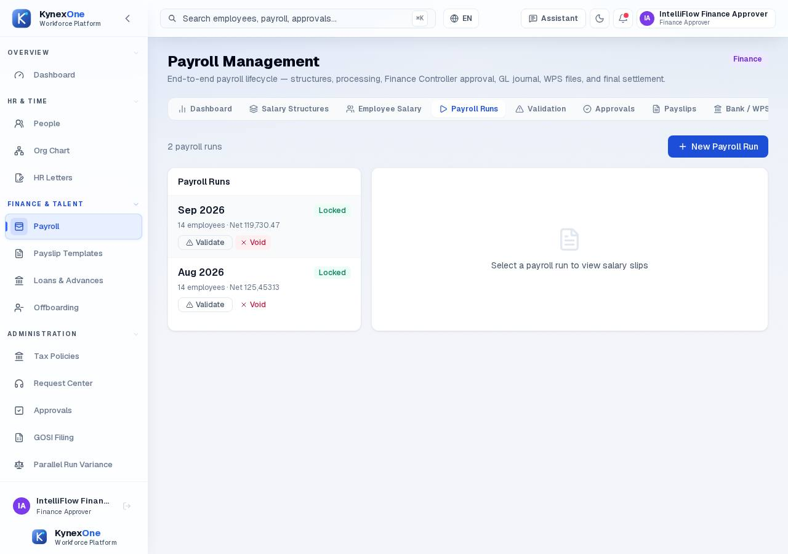

## 11. Generate the payslips for the locked run

- **Actor** — IntelliFlow HR Manager (HR Manager), `hr*******@intelliflow.com`, tenant `intelliflow`, scope `group`
- **When (UTC)** — 2026-09-30T19:51:10.336Z (2162 ms)
- **Business record** — PayrollRun `2dbe8b64-ea51-41f8-a8d8-64981d53d86a`
- **Expected** — Exactly 14 payslips, one per distinct employee, each with a real payslip number, and each published to employee self-service (the run is locked, so the month is already being paid).
- **Observed** — 14 payslips, 14 distinct numbers, 14 distinct employees.
- **API**
  - `GET /api/help-texts` → **200** (0 ms)
  - `GET /api/auth/me` → **200** (0 ms)
  - `GET /api/features/disabled-keys` → **200** (0 ms)
  - `GET /api/features/modules` → **200** (0 ms)
  - `GET /api/notifications` → **200** (0 ms)
  - `GET /api/tenant-admin/localization` → **200** (0 ms)
  - `GET /api/payroll/companies` → **200** (0 ms)
  - `GET /api/payroll/reports/summary` → **200** (0 ms)
  - `GET /api/payroll/overview?year=2026&month=9` → **200** (0 ms)
  - `GET /api/payroll/readiness?year=2026&month=9` → **200** (0 ms)
  - `GET /api/payroll/runs?page=1&pageSize=100` → **200** (0 ms)
  - `GET /api/payroll/runs/2dbe8b64-ea51-41f8-a8d8-64981d53d86a/payslips?page=1&pageSize=100` → **200** (0 ms)
  - …and 3 more, in `manifest.json`
- **Persisted (fresh GET)** — payslips=`14`, distinctEmployees=`14`, distinctPayslipNumbers=`14`, publishedToEss=`14`
- **Screen assertion** — the settled screen showed Total Payslips
- **Image** — `img/11-payslips.jpg`, sha256 `efbdd436c5d1b38837a1c1ea5a142501603347ad0ad4a6b5951f9a7941b70986` (original sha256 `2aff91e43b7c3305de69113b625c0df5ec6513c148c2351cee1b6f999c288147`, 101250 bytes)
- **Settled** — after 440 ms; waited out 0 request(s) and 0 loading indicator(s); 14 node(s) redacted

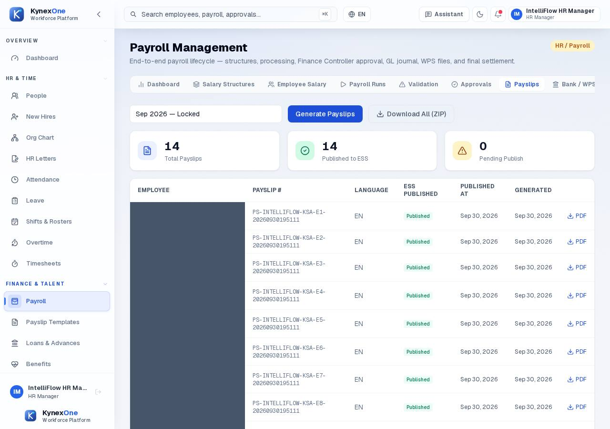

## 12. Create the payment batch now that the run is locked

- **Actor** — IntelliFlow Administrator (Admin), `ad***@intelliflow.com`, tenant `intelliflow`, scope `group`
- **When (UTC)** — 2026-09-30T19:51:12.498Z (2228 ms)
- **Business record** — PayrollPaymentBatch `007f022d-07b8-42ad-9ef1-6b8aaf6449d2`
- **Expected** — The control is enabled, the blocking notice is gone, and the batch's total equals the run's net pay with one payment line per employee.
- **Observed** — Batch PAY-202609-195113 created in Draft for SAR 119,730.47.
- **API**
  - `GET /api/help-texts` → **200** (0 ms)
  - `GET /api/auth/me` → **200** (0 ms)
  - `GET /api/notifications` → **200** (0 ms)
  - `GET /api/features/modules` → **200** (0 ms)
  - `GET /api/features/disabled-keys` → **200** (0 ms)
  - `GET /api/tenant-admin/localization` → **200** (0 ms)
  - `GET /api/payroll/reports/summary` → **200** (0 ms)
  - `GET /api/payroll/companies` → **200** (0 ms)
  - `GET /api/ai/insights?acknowledged=false&pageSize=5` → **200** (0 ms)
  - `GET /api/payroll/overview?year=2026&month=9` → **200** (0 ms)
  - `GET /api/payroll/readiness?year=2026&month=9` → **200** (0 ms)
  - `GET /api/payroll/runs?page=1&pageSize=100` → **200** (0 ms)
  - …and 5 more, in `manifest.json`
- **Persisted (fresh GET)** — batchId=`"007f022d-07b8-42ad-9ef1-6b8aaf6449d2"`, batchNumber=`"PAY-202609-195113"`, paymentRecords=`14`, sumOfPaymentLines=`119730.47`, recordStatuses=`["Pending"]`
- **Screen assertion** — the settled screen showed /Draft/
- **Image** — `img/12-payment-batch.jpg`, sha256 `b946648899c441961390f2c16360cd86dd61cc60d3ca91b5d2b058bdcde3e776` (original sha256 `fff3ee37ba30655f8df657f17d4956153983b614651fe31ebcb2669562e51a60`, 96842 bytes)
- **Settled** — after 435 ms; waited out 0 request(s) and 0 loading indicator(s); 14 node(s) redacted

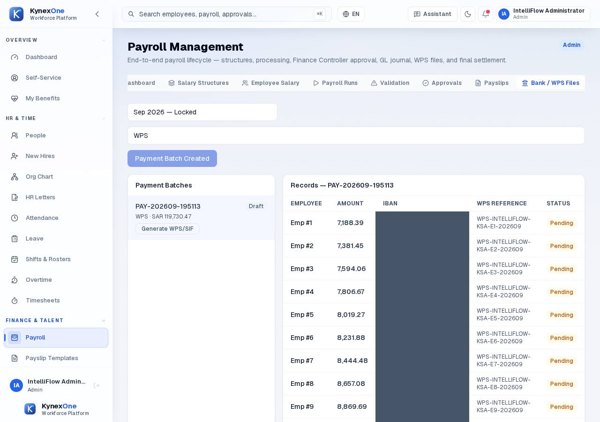

## 13. Generate the WPS/SIF bank file (generation only — this must not pay anybody)

- **Actor** — IntelliFlow Administrator (Admin), `ad***@intelliflow.com`, tenant `intelliflow`, scope `group`
- **When (UTC)** — 2026-09-30T19:51:14.726Z (2080 ms)
- **Business record** — PayrollPaymentBatch `007f022d-07b8-42ad-9ef1-6b8aaf6449d2`
- **Expected** — The batch reaches File Generated with a named file, a content hash, one record per employee and a total equal to the run's net pay. The run stays Locked, the batch is not settled, and no payment record says paid.
- **Observed** — mudad_wps_0000000000_202609.xml: 14 records, total 119730.47, sha256 aae7df796a426369…
- **API**
  - `POST /api/payroll/payment-batches/007f022d-07b8-42ad-9ef1-6b8aaf6449d2/wps-file` → **200** (0 ms)
  - `GET /api/help-texts` → **200** (0 ms)
  - `GET /api/auth/me` → **200** (0 ms)
  - `GET /api/notifications` → **200** (0 ms)
  - `GET /api/features/modules` → **200** (0 ms)
  - `GET /api/tenant-admin/localization` → **200** (0 ms)
  - `GET /api/features/disabled-keys` → **200** (0 ms)
  - `GET /api/ai/insights?acknowledged=false&pageSize=5` → **200** (0 ms)
  - `GET /api/payroll/companies` → **200** (0 ms)
  - `GET /api/payroll/reports/summary` → **200** (0 ms)
  - `GET /api/payroll/overview?year=2026&month=9` → **200** (0 ms)
  - `GET /api/payroll/readiness?year=2026&month=9` → **200** (0 ms)
  - …and 5 more, in `manifest.json`
- **Persisted (fresh GET of the run, the batch and every payment record — the "nobody was paid" check)** — runStatus=`"Locked"`, batchStatus=`"FileGenerated"`, batchWpsStatus=`"Generated"`, paymentRecordStatuses=`["Pending"]`, anyRecordMarkedPaid=`false`, settleEndpointCalled=`false`
- **Screen assertion** — the settled screen showed File Generated
- **Image** — `img/13-bank-export-generation-only.jpg`, sha256 `65a0d556f1efee86193f4116317b4f2a27513ffe97710f9058372ab3876084ec` (original sha256 `65a0d556f1efee86193f4116317b4f2a27513ffe97710f9058372ab3876084ec`, 62567 bytes)
- **Settled** — after 447 ms; waited out 0 request(s) and 0 loading indicator(s); 0 node(s) redacted

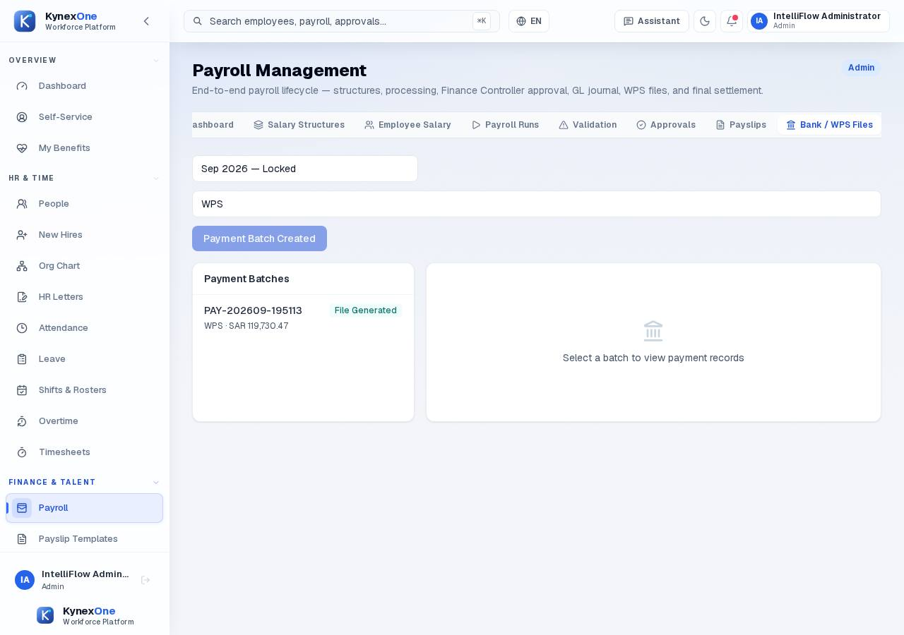

## 14. Reconcile the displayed totals against the source records

- **Actor** — IntelliFlow Finance Approver (Finance Approver), `fi*****@intelliflow.com`, tenant `intelliflow`, scope `group`
- **When (UTC)** — 2026-09-30T19:51:16.806Z (1794 ms)
- **Business record** — PayrollRun `2dbe8b64-ea51-41f8-a8d8-64981d53d86a`
- **Expected** — The reconciliation report's current-period gross and net equal the run's own totals, which equal the sum of the per-employee salary slips, which equal the sum of the payment lines, which equal the wage file total.
- **Observed** — Reconciliation: headcount 14, gross 138250.00, net 119730.47, 0 flagged variance(s).
- **API**
  - `GET /api/help-texts` → **200** (0 ms)
  - `GET /api/auth/me` → **200** (0 ms)
  - `GET /api/features/disabled-keys` → **200** (0 ms)
  - `GET /api/notifications` → **200** (0 ms)
  - `GET /api/tenant-admin/localization` → **200** (0 ms)
  - `GET /api/features/modules` → **200** (0 ms)
  - `GET /api/payroll/companies` → **200** (0 ms)
  - `GET /api/payroll/reports/summary` → **200** (0 ms)
  - `GET /api/payroll/overview?year=2026&month=9` → **200** (0 ms)
  - `GET /api/payroll/readiness?year=2026&month=9` → **200** (0 ms)
  - `GET /api/payroll/companies` → **200** (0 ms)
  - `GET /api/payroll/runs?page=1&pageSize=100` → **200** (0 ms)
  - …and 5 more, in `manifest.json`
- **Persisted (fresh GETs of the run, its salary slips, the bank payment lines and the reconciliation report)** — runTotalNet=`119730.47`, sumOfSalarySlipNet=`119730.47`, sumOfBankPaymentLines=`119730.47`, reconciliationReportNet=`119730.47`, netShownOnApprovalScreen=`119730.47`, allFiveAgree=`true`
- **Screen assertion** — the settled screen showed /Reconciliation|Variance|Headcount/i
- **Image** — `img/14-reconciliation.jpg`, sha256 `9ebb4aceab76c4210c9cf6c4df39e767747742203d627b2f602d7ecee13979b7` (original sha256 `9ebb4aceab76c4210c9cf6c4df39e767747742203d627b2f602d7ecee13979b7`, 62485 bytes)
- **Settled** — after 435 ms; waited out 0 request(s) and 0 loading indicator(s); 0 node(s) redacted

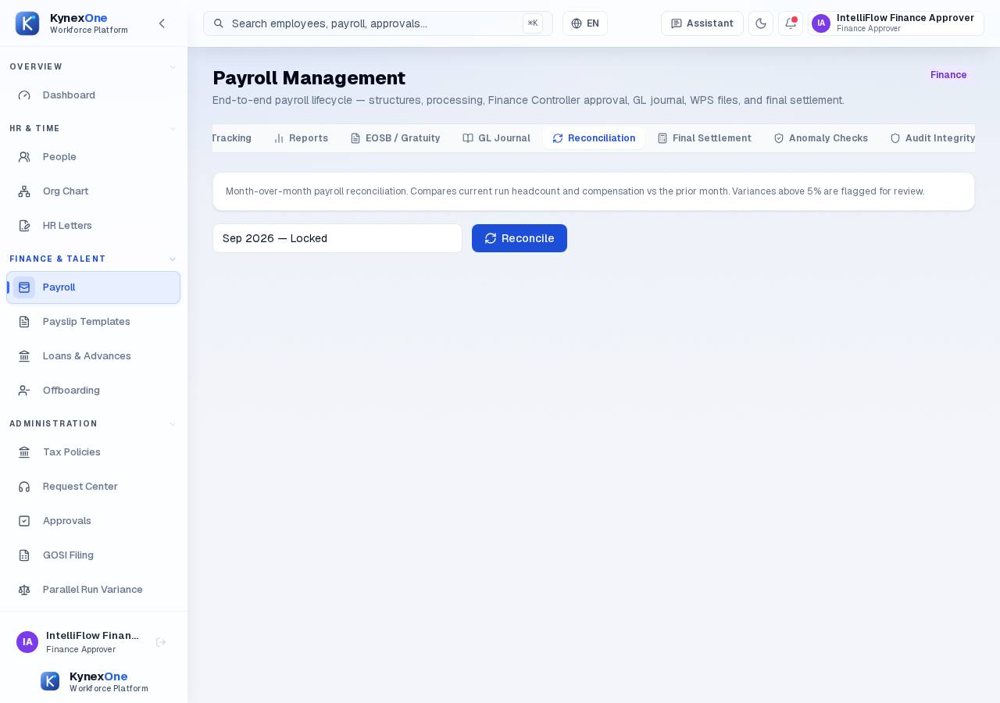

## Not run

Areas this story did not execute. Recorded so that no one reads their absence as a pass.

- **The UI path for the incomplete-data refusal (R1)** — Not run. R1 was driven through the API, so the bundle has no image of it and does not claim one. Whether the employee form surfaces the same 422 legibly is untested here.
- **Payment settlement (marking employees paid)** — Deliberately not run. POST /api/payroll/payment-batches/{id}/settle is the endpoint that marks a batch and its records paid; this story stops at file generation, and step 10 records that nothing was marked paid. Settlement has NO evidence here and must not be read as covered.
- **Bank submission and the bank's own response** — Not run: no bank or WPS endpoint is reachable from a disposable stack. The file is generated and hashed; whether a bank would accept it is untested here.
- **Payroll for the other fixture tenants (Ras Al-Manar, Almarai group, Tata group)** — Not run. This story is one tenant, IntelliFlow, end to end. Multi-company group payroll is covered by e2e/group-company/ as assertions, not as evidence.

