# ERD — 76 tables, by domain

Pinned to `../../TARGET_SCHEMA.md` **revision 7**. Two revision-7 decisions are visible in the column
stubs below and are worth knowing before reading them: every attendance and timesheet duration is
**whole minutes** (leave alone is days), and every accounting or payroll period is **two `smallint`
columns, `year` + `month`** — never a bare `period`.

One diagram per domain, plus a domain-coupling map. **There is deliberately no single all-tables
diagram**: at 76 tables it would be unreadable and nobody would open it twice.

Columns are not drawn. Relationships are. For columns, use `DATA_DICTIONARY.md`.

### Reading the notation

Mermaid crow's foot. The left half of the symbol is the left entity's cardinality, the right half
the right entity's.

- `||` exactly one · `|o` zero-or-one · `}o` zero-or-more · `}|` one-or-more
- So `A ||--o{ B` is "one A, zero or more B".
- `}o--o{` (many-to-many) appears nowhere in this schema: every one is resolved by a join table.

Tables drawn in a domain that is not their own (e.g. `employees` inside the Payroll diagram) are the
**target** of a cross-domain FK and are defined in their own section.

Every `T`/`C` table also has an implicit `tenant_id` FK to `tenants` and a composite
`(tenant_id, …)` FK on each edge shown. Those edges are omitted from the diagrams or every picture
would be a star around `tenants`.

**Five tables are monthly RANGE-partitioned** (§19.3) and are marked **⧉** where they appear:
`attendance_punches` · `attendance_days` · `timesheet_entries` · `audit_logs` ·
`background_job_items`. Their primary keys are composite `(id, <partition key>)`, and **only
`attendance_days` is an FK target** — which is why the other four can be partitioned freely.

---

## Domain coupling

Which domain's tables reference which. An arrow means "has at least one FK into".

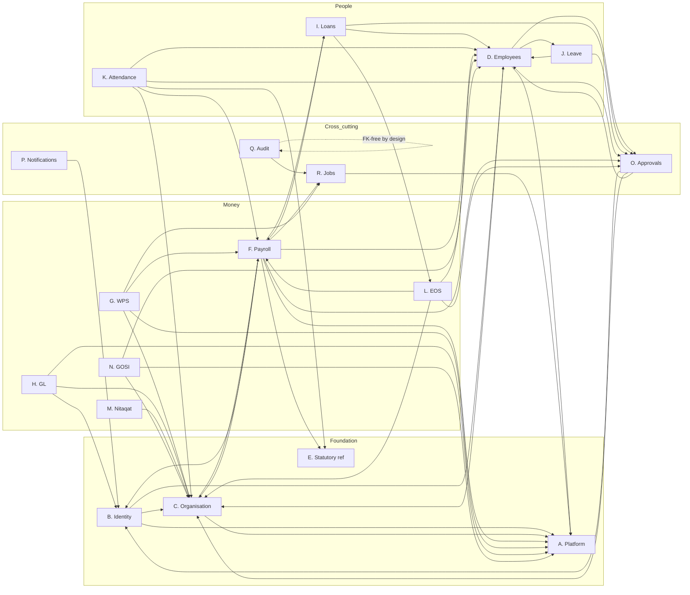
```mermaid
flowchart LR
    subgraph Foundation
        A["A. Platform"]
        B["B. Identity"]
        C["C. Organisation"]
        E["E. Statutory ref"]
    end

    subgraph People
        D["D. Employees"]
        J["J. Leave"]
        K["K. Attendance"]
        I["I. Loans"]
    end

    subgraph Money
        F["F. Payroll"]
        G["G. WPS"]
        H["H. GL"]
        L["L. EOS"]
        N["N. GOSI"]
        M["M. Nitaqat"]
    end

    subgraph Cross_cutting
        O["O. Approvals"]
        P["P. Notifications"]
        Q["Q. Audit"]
        R["R. Jobs"]
    end

    B --> A
    B --> C
    B --> D
    C --> A
    C --> F
    D --> A
    D --> C
    D --> J
    D --> O
    I --> D
    I --> O
    I --> F
    I --> L
    J --> D
    J --> O
    K --> C
    K --> D
    K --> E
    K --> F
    K --> O
    F --> A
    F --> C
    F --> D
    F --> E
    F --> I
    F --> O
    F --> R
    F --> B
    G --> A
    G --> C
    G --> F
    G --> R
    H --> A
    H --> B
    H --> C
    L --> C
    L --> D
    L --> F
    L --> O
    M --> C
    N --> A
    N --> C
    N --> D
    O --> B
    O --> C
    O --> D
    P --> B
    Q --> R
    R --> A

    Q -.->|"FK-free by design"| Q
```

**What this map is for.** A domain with many outward arrows is expensive to change in isolation.
`F. Payroll` reaches into eight domains — that is the schema's centre of gravity and the reason
`TARGET_SCHEMA.md` §6 Risk 6 sequences the rewrite around it. `Q. Audit` has no FKs at all, by
design, so audit rows outlive the rows they describe through a PDPL purge.

---

## A. Platform, tenancy and shared infrastructure

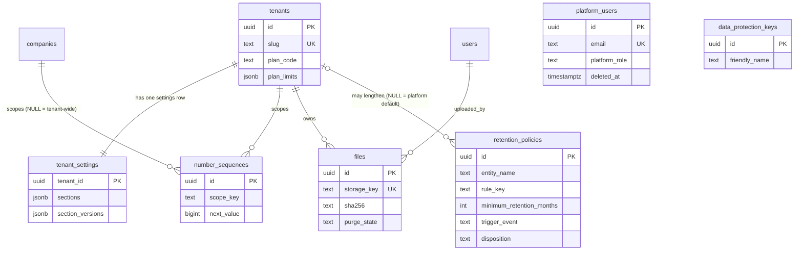
```mermaid
erDiagram
    tenants ||--|| tenant_settings : "has one settings row"
    tenants ||--o{ number_sequences : "scopes"
    tenants ||--o{ files : "owns"
    tenants |o--o{ retention_policies : "may lengthen (NULL = platform default)"
    companies ||--o{ number_sequences : "scopes (NULL = tenant-wide)"
    users ||--o{ files : "uploaded_by"

    tenants {
        uuid id PK
        text slug UK
        text plan_code
        jsonb plan_limits
    }
    tenant_settings {
        uuid tenant_id PK
        jsonb sections
        jsonb section_versions
    }
    number_sequences {
        uuid id PK
        text scope_key
        bigint next_value
    }
    files {
        uuid id PK
        text storage_key UK
        text sha256
        text purge_state
    }
    platform_users {
        uuid id PK
        text email UK
        text platform_role
        timestamptz deleted_at
    }
    retention_policies {
        uuid id PK
        text entity_name
        text rule_key
        int minimum_retention_months
        text trigger_event
        text disposition
    }
    data_protection_keys {
        uuid id PK
        text friendly_name
    }
```

`data_protection_keys` is intentionally unconnected: it is the ASP.NET key ring, managed by the
framework, and no application row points at it.

`platform_users` is intentionally unconnected here too: platform operators are a **separate table**
(§5 decision 2) so no nullable-tenant row sits in a client-data table. They share `auth_sessions`
and `auth_tokens` with `users` through an XOR CHECK — drawn in domain B.

`retention_policies` is the **PDPL retention matrix as data** (new in revision 3). Nothing FKs to
it: `retention_purge_audits.rule_key` matches it by text, deliberately, so purge evidence outlives
a policy row. A tenant row may only **lengthen** the platform period it overrides.

`files` is referenced from six domains (`employee_documents`, `payroll_slips`, `wps_batches`,
`gl_journals`, `gosi_filings`, `background_jobs`). Those edges are drawn in their own diagrams.

---

## B. Identity and access

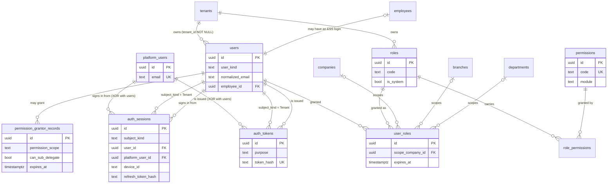
```mermaid
erDiagram
    tenants ||--o{ users : "owns (tenant_id NOT NULL)"
    tenants ||--o{ roles : "owns"
    users ||--o{ permission_grantor_records : "may grant"
    platform_users ||--o{ auth_sessions : "signs in from (XOR with users)"
    platform_users ||--o{ auth_tokens : "is issued (XOR with users)"
    users ||--o{ auth_sessions : "subject_kind = Tenant"
    users ||--o{ auth_tokens : "subject_kind = Tenant"
    users ||--o{ user_roles : "granted"
    roles ||--o{ user_roles : "granted as"
    roles ||--o{ role_permissions : "carries"
    permissions ||--o{ role_permissions : "granted by"
    users ||--o{ auth_sessions : "signs in from"
    users ||--o{ auth_tokens : "is issued"
    employees |o--|| users : "may have an ESS login"
    companies |o--o{ user_roles : "scopes"
    branches |o--o{ user_roles : "scopes"
    departments |o--o{ user_roles : "scopes"

    users {
        uuid id PK
        text user_kind
        text normalized_email
        uuid employee_id FK
    }
    roles {
        uuid id PK
        text code
        bool is_system
    }
    permissions {
        uuid id PK
        text code UK
        text module
    }
    user_roles {
        uuid id PK
        uuid scope_company_id FK
        timestamptz expires_at
    }
    auth_sessions {
        uuid id PK
        text subject_kind
        uuid user_id FK
        uuid platform_user_id FK
        text device_id
        text refresh_token_hash
    }
    auth_tokens {
        uuid id PK
        text purpose
        text token_hash UK
    }
    permission_grantor_records {
        uuid id PK
        text permission_scope
        bool can_sub_delegate
        timestamptz expires_at
    }
    platform_users {
        uuid id PK
        text email UK
    }
```

`user_roles` carries **three optional scope FKs** and an `expires_at`. That single row replaces
`UserEntityAccesses` and `UserPermissionOverrides`; a per-user grant becomes a custom role with a
scope and an expiry (§5 decision 5).

`permission_grantor_records` does **not** fold into it (decision F5). `user_roles.granted_by`
records who made *one* grant; it cannot express who **may** grant, over what scope, with what
sub-delegation right, until when. It is live at three endpoints and read before any grant is
allowed.

**`users.tenant_id` is `NOT NULL`.** `auth_sessions` and `auth_tokens` are the **only two** tables
in the schema with a nullable `tenant_id`, because they serve both `users` and `platform_users`
through an XOR CHECK — duplicating rotation, reuse detection and lockout would breach the
no-duplicate-tables principle.

`auth_sessions` is keyed by device, not by login, so token rotation never loses a push registration.

---

## C. Organisation

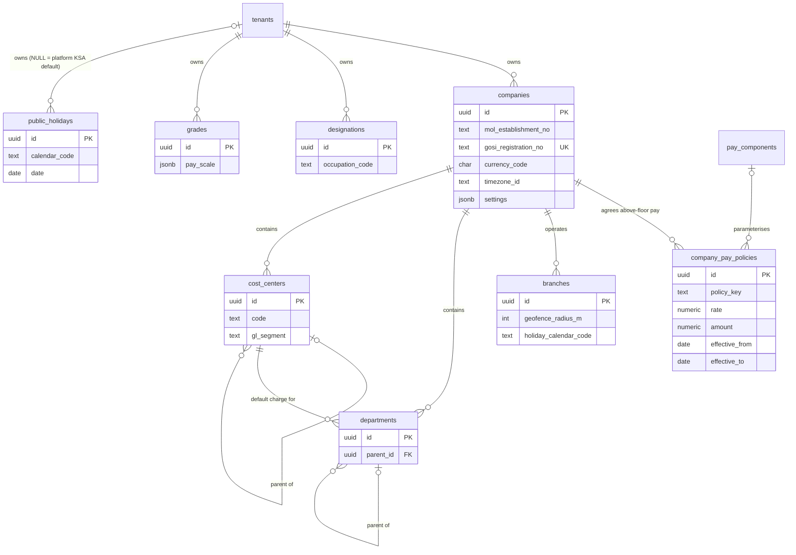
```mermaid
erDiagram
    tenants ||--o{ companies : "owns"
    tenants ||--o{ designations : "owns"
    tenants ||--o{ grades : "owns"
    tenants |o--o{ public_holidays : "owns (NULL = platform KSA default)"
    companies ||--o{ company_pay_policies : "agrees above-floor pay"
    pay_components |o--o{ company_pay_policies : "parameterises"
    companies ||--o{ branches : "operates"
    companies ||--o{ departments : "contains"
    companies ||--o{ cost_centers : "contains"
    departments |o--o{ departments : "parent of"
    cost_centers |o--o{ cost_centers : "parent of"
    cost_centers ||--o{ departments : "default charge for"

    companies {
        uuid id PK
        text mol_establishment_no
        text gosi_registration_no UK
        char currency_code
        text timezone_id
        jsonb settings
    }
    company_pay_policies {
        uuid id PK
        text policy_key
        numeric rate
        numeric amount
        date effective_from
        date effective_to
    }
    branches {
        uuid id PK
        int geofence_radius_m
        text holiday_calendar_code
    }
    departments {
        uuid id PK
        uuid parent_id FK
    }
    cost_centers {
        uuid id PK
        text code
        text gl_segment
    }
    designations {
        uuid id PK
        text occupation_code
    }
    grades {
        uuid id PK
        jsonb pay_scale
    }
    public_holidays {
        uuid id PK
        text calendar_code
        date date
    }
```

`branches.holiday_calendar_code` joins `public_holidays.calendar_code` by **text code, not an FK**
— see `DATA_DICTIONARY.md` gap 7.

`cost_centers` is referenced from five other domains and is the reason it is a table rather than a
code on `departments`.

`company_pay_policies` is new in revision 3: contractual above-floor pay moved **out of
`companies.settings` JSON** into a real effective-dated table, so it gets the same
`EXCLUDE … gist` no-overlap guarantee as every other dated structure. Statutory values themselves
remain non-overridable.

`companies.gosi_registration_no` carries `UNIQUE (tenant_id, gosi_registration_no)` so
`employee_gosi_registrations` and `gosi_filings` can FK to it rather than matching by text.

---

## D. Employees, history, documents and letters

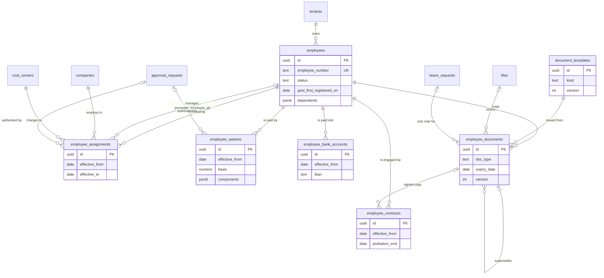
```mermaid
erDiagram
    tenants ||--o{ employees : "owns"
    employees ||--o{ employee_assignments : "is placed by"
    employees ||--o{ employee_salaries : "is paid by"
    employees ||--o{ employee_contracts : "is engaged by"
    employees ||--o{ employee_bank_accounts : "is paid into"
    employees ||--o{ employee_documents : "holds"
    employees |o--o{ employee_assignments : "manages (manager_employee_id)"
    employee_documents |o--o{ employee_documents : "supersedes"
    document_templates ||--o{ employee_documents : "issued from"
    files |o--o{ employee_documents : "stores"
    employee_documents |o--o{ employee_contracts : "signed copy"
    companies ||--o{ employee_assignments : "employs in"
    cost_centers ||--o{ employee_assignments : "charges to"
    approval_requests |o--o{ employee_assignments : "authorised by"
    approval_requests |o--o{ employee_salaries : "authorised by"
    leave_requests |o--o{ employee_documents : "sick note for"

    employees {
        uuid id PK
        text employee_number UK
        text status
        date gosi_first_registered_on
        jsonb dependents
    }
    employee_assignments {
        uuid id PK
        date effective_from
        date effective_to
    }
    employee_salaries {
        uuid id PK
        date effective_from
        numeric basic
        jsonb components
    }
    employee_contracts {
        uuid id PK
        date effective_from
        date probation_end
    }
    employee_bank_accounts {
        uuid id PK
        date effective_from
        text iban
    }
    employee_documents {
        uuid id PK
        text doc_type
        date expiry_date
        int version
    }
    document_templates {
        uuid id PK
        text kind
        int version
    }
```

The four `effective_from`/`effective_to` tables each carry an `EXCLUDE … gist` no-overlap
constraint per employee. That is what makes "what was this person paid on 14 March" a single-row
query rather than an ordering heuristic.

---

## E. Statutory reference

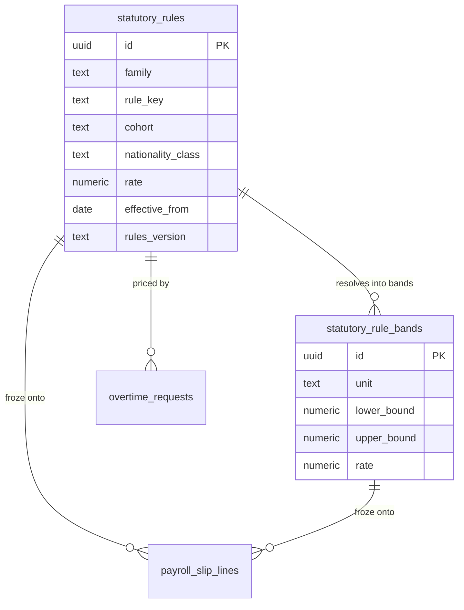
```mermaid
erDiagram
    statutory_rules ||--o{ statutory_rule_bands : "resolves into bands"
    statutory_rules ||--o{ payroll_slip_lines : "froze onto"
    statutory_rule_bands ||--o{ payroll_slip_lines : "froze onto"
    statutory_rules ||--o{ overtime_requests : "priced by"

    statutory_rules {
        uuid id PK
        text family
        text rule_key
        text cohort
        text nationality_class
        numeric rate
        date effective_from
        text rules_version
    }
    statutory_rule_bands {
        uuid id PK
        text unit
        numeric lower_bound
        numeric upper_bound
        numeric rate
    }
```

Reference tier: seeded by the baseline, **no tenant may override a row**. Above-floor contractual
enhancements live in `companies.settings.pay_policy` and the engine applies
`max(statutory, contractual)`.

A regulation change is a **new effective-dated row**, never an edit — which is what makes the
`statutory_rule_id` frozen on a 2025 slip line still resolvable in 2030.

`nitaqat_grid` is also reference data but stays in domain M, because its key is activity × size
tier, which this dimension set does not carry.

---

## F. Payroll

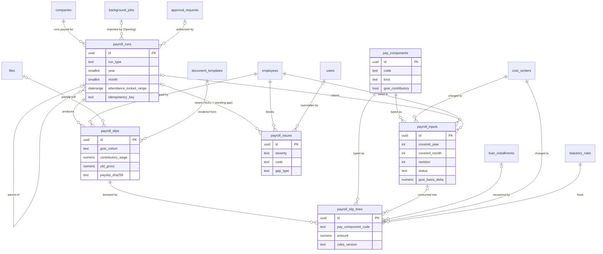
```mermaid
erDiagram
    companies ||--o{ payroll_runs : "runs payroll for"
    payroll_runs |o--o{ payroll_runs : "parent of"
    payroll_runs ||--o{ payroll_slips : "produces"
    payroll_slips ||--o{ payroll_slip_lines : "itemised by"
    employees ||--o{ payroll_slips : "is paid by"
    pay_components ||--o{ payroll_slip_lines : "typed as"
    pay_components ||--o{ payroll_inputs : "typed as"
    payroll_inputs |o--o{ payroll_slip_lines : "consumed into"
    loan_installments |o--o{ payroll_slip_lines : "recovered by"
    cost_centers ||--o{ payroll_slip_lines : "charged to"
    cost_centers ||--o{ payroll_inputs : "charged to"
    employees ||--o{ payroll_inputs : "owed to"
    payroll_runs |o--o{ payroll_inputs : "claims"
    payroll_runs |o--o{ payroll_issues : "raises (NULL = standing gap)"
    employees ||--o{ payroll_issues : "blocks"
    users |o--o{ payroll_issues : "overridden by"
    background_jobs |o--o{ payroll_runs : "imported by (Opening)"
    approval_requests |o--o{ payroll_runs : "authorised by"
    files |o--o{ payroll_slips : "payslip pdf"
    document_templates |o--o{ payroll_slips : "rendered from"
    statutory_rules ||--o{ payroll_slip_lines : "froze"

    payroll_runs {
        uuid id PK
        text run_type
        smallint year
        smallint month
        daterange attendance_locked_range
        text idempotency_key
    }
    payroll_slips {
        uuid id PK
        text gosi_cohort
        numeric contributory_wage
        numeric ytd_gross
        text payslip_sha256
    }
    payroll_slip_lines {
        uuid id PK
        text pay_component_code
        numeric amount
        text rules_version
    }
    payroll_inputs {
        uuid id PK
        int covered_year
        int covered_month
        int revision
        text status
        numeric gosi_basis_delta
    }
    payroll_issues {
        uuid id PK
        text severity
        text code
        text gap_type
    }
    pay_components {
        uuid id PK
        text code
        text kind
        bool gosi_contributory
    }
```

This is the schema's centre of gravity. Three things to understand before changing anything here:

1. **`payroll_slips` and `payroll_slip_lines` are frozen.** Once the run is `Locked`, a trigger
   rejects `UPDATE` and `DELETE`. A correction is a new run, not an edit.
2. **`payroll_inputs` is the single spine** for every variable pay item from eight former tables.
   `covered_*` (which period the money belongs to) is separate from `run_*` (which period pays it),
   and that separation is the whole reason backdated pay reconciles.
3. **`payroll_issues.run_id` is nullable.** A NULL is a *standing* readiness gap that blocks any
   run — not a finding about one run.

---

## G. WPS, and H. GL export

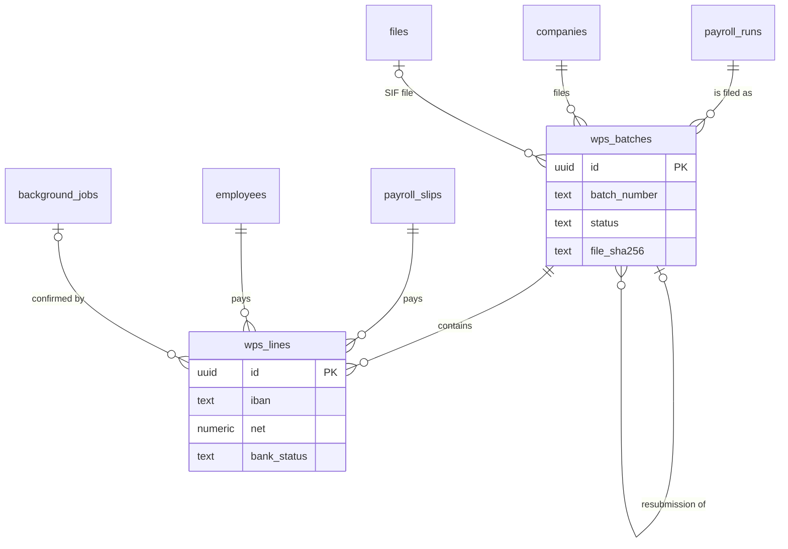
```mermaid
erDiagram
    payroll_runs ||--o{ wps_batches : "is filed as"
    companies ||--o{ wps_batches : "files"
    wps_batches |o--o{ wps_batches : "resubmission of"
    wps_batches ||--o{ wps_lines : "contains"
    payroll_slips ||--o{ wps_lines : "pays"
    employees ||--o{ wps_lines : "pays"
    files |o--o{ wps_batches : "SIF file"
    background_jobs |o--o{ wps_lines : "confirmed by"

    wps_batches {
        uuid id PK
        text batch_number
        text status
        text file_sha256
    }
    wps_lines {
        uuid id PK
        text iban
        numeric net
        text bank_status
    }
```

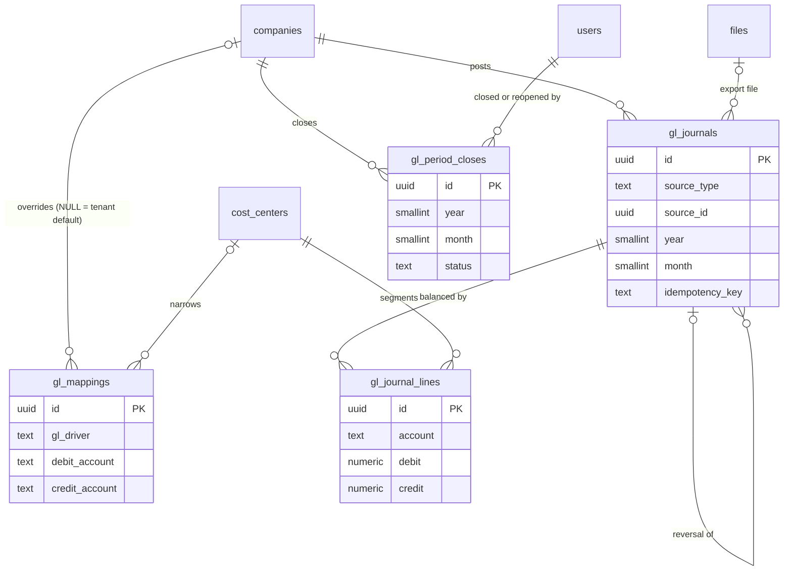
```mermaid
erDiagram
    companies ||--o{ gl_journals : "posts"
    companies |o--o{ gl_mappings : "overrides (NULL = tenant default)"
    gl_journals ||--o{ gl_journal_lines : "balanced by"
    gl_journals |o--o{ gl_journals : "reversal of"
    cost_centers ||--o{ gl_journal_lines : "segments"
    cost_centers |o--o{ gl_mappings : "narrows"
    companies ||--o{ gl_period_closes : "closes"
    users ||--o{ gl_period_closes : "closed or reopened by"
    files |o--o{ gl_journals : "export file"

    gl_mappings {
        uuid id PK
        text gl_driver
        text debit_account
        text credit_account
    }
    gl_journals {
        uuid id PK
        text source_type
        uuid source_id
        smallint year
        smallint month
        text idempotency_key
    }
    gl_journal_lines {
        uuid id PK
        text account
        numeric debit
        numeric credit
    }
    gl_period_closes {
        uuid id PK
        smallint year
        smallint month
        text status
    }
```

A GL correction is a **reversal journal** pointing back via `reversal_of_id`, never an edit.
An `Opening` payroll run never posts to GL and never produces a WPS batch.

---

## I. Loans, and J. Leave

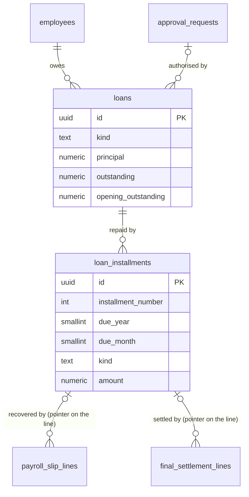
```mermaid
erDiagram
    employees ||--o{ loans : "owes"
    loans ||--o{ loan_installments : "repaid by"
    loan_installments |o--o{ payroll_slip_lines : "recovered by (pointer on the line)"
    loan_installments |o--o{ final_settlement_lines : "settled by (pointer on the line)"
    approval_requests |o--o{ loans : "authorised by"

    loans {
        uuid id PK
        text kind
        numeric principal
        numeric outstanding
        numeric opening_outstanding
    }
    loan_installments {
        uuid id PK
        int installment_number
        smallint due_year
        smallint due_month
        text kind
        numeric amount
    }
```

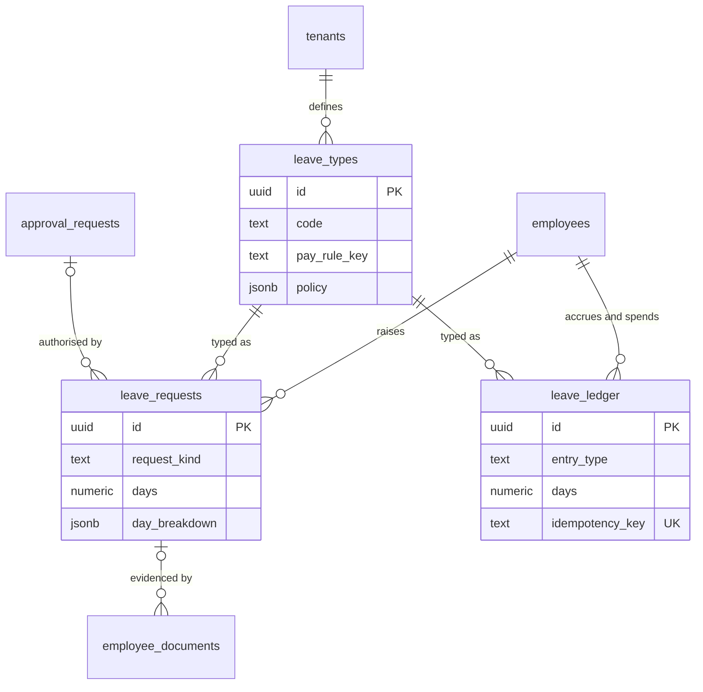
```mermaid
erDiagram
    tenants ||--o{ leave_types : "defines"
    employees ||--o{ leave_requests : "raises"
    leave_types ||--o{ leave_requests : "typed as"
    employees ||--o{ leave_ledger : "accrues and spends"
    leave_types ||--o{ leave_ledger : "typed as"
    approval_requests |o--o{ leave_requests : "authorised by"
    leave_requests |o--o{ employee_documents : "evidenced by"

    leave_types {
        uuid id PK
        text code
        text pay_rule_key
        jsonb policy
    }
    leave_requests {
        uuid id PK
        text request_kind
        numeric days
        jsonb day_breakdown
    }
    leave_ledger {
        uuid id PK
        text entry_type
        numeric days
        text idempotency_key UK
    }
```

`leave_ledger` is append-only. **There is no balance table** — a balance is `SUM(days)`, exposed as
the view `v_leave_balances`. A correction is a `Reversal` row, never an update.

---

## K. Attendance, overtime and timesheets

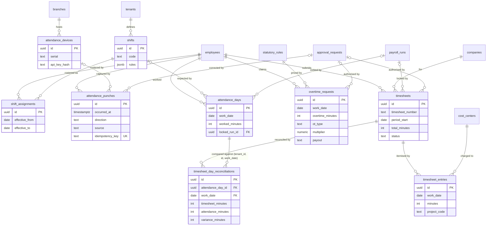
```mermaid
erDiagram
    tenants ||--o{ shifts : "defines"
    employees ||--o{ shift_assignments : "rostered by"
    shifts ||--o{ shift_assignments : "rostered as"
    branches ||--o{ attendance_devices : "hosts"
    employees ||--o{ attendance_punches : "clocks"
    attendance_devices |o--o{ attendance_punches : "captured by"
    employees ||--o{ attendance_days : "worked"
    shifts |o--o{ attendance_days : "expected by"
    payroll_runs |o--o{ attendance_days : "locked by"
    employees ||--o{ overtime_requests : "claims"
    statutory_rules ||--o{ overtime_requests : "priced by"
    employees ||--o{ timesheets : "submits"
    companies ||--o{ timesheets : "for"
    timesheets ||--o{ timesheet_entries : "itemised by"
    timesheets ||--o{ timesheet_day_reconciliations : "reconciled by"
    attendance_days ||--o{ timesheet_day_reconciliations : "compared against (tenant_id, id, work_date)"
    cost_centers ||--o{ timesheet_entries : "charged to"
    payroll_runs |o--o{ timesheets : "locked by"
    approval_requests |o--o{ overtime_requests : "authorised by"
    approval_requests |o--o{ timesheets : "authorised by"
    approval_requests |o--o{ attendance_punches : "corrected by"

    shifts {
        uuid id PK
        text code
        jsonb rules
    }
    shift_assignments {
        uuid id PK
        date effective_from
        date effective_to
    }
    attendance_devices {
        uuid id PK
        text serial
        text api_key_hash
    }
    attendance_punches {
        uuid id PK
        timestamptz occurred_at
        text direction
        text source
        text idempotency_key UK
    }
    attendance_days {
        uuid id PK
        date work_date
        int worked_minutes
        uuid locked_run_id FK
    }
    overtime_requests {
        uuid id PK
        date work_date
        int overtime_minutes
        text ot_type
        numeric multiplier
        text payout
    }
    timesheets {
        uuid id PK
        text timesheet_number
        date period_start
        int total_minutes
        text status
    }
    timesheet_entries {
        uuid id PK
        date work_date
        int minutes
        text project_code
    }
    timesheet_day_reconciliations {
        uuid id PK
        uuid attendance_day_id FK
        date work_date FK
        int timesheet_minutes
        int attendance_minutes
        int variance_minutes
    }
```

**Attendance locking is enforced in three places and has no table of its own:**
`payroll_runs.attendance_locked_range` (a `daterange` with a CHECK that it lies inside the run
period) · `attendance_days.locked_run_id` · a trigger that rejects any write to
`attendance_punches`, `attendance_days`, `overtime_requests` or `timesheet_entries` whose date
falls inside a locked range of a non-voided run. Voiding the run clears the lock in the same
transaction.

**`timesheet_day_reconciliations` now has a real, composite FK** into `attendance_days`:
`(tenant_id, attendance_day_id, work_date) → attendance_days (tenant_id, id, work_date)` (§8 row
126). The partition key is part of the key because `attendance_days` is partitioned, and the
reconciliation row already carried `work_date`, so no new column was needed. **This is the only FK
in the schema targeting a partitioned table.**

---

## L. EOS, and M. Nitaqat

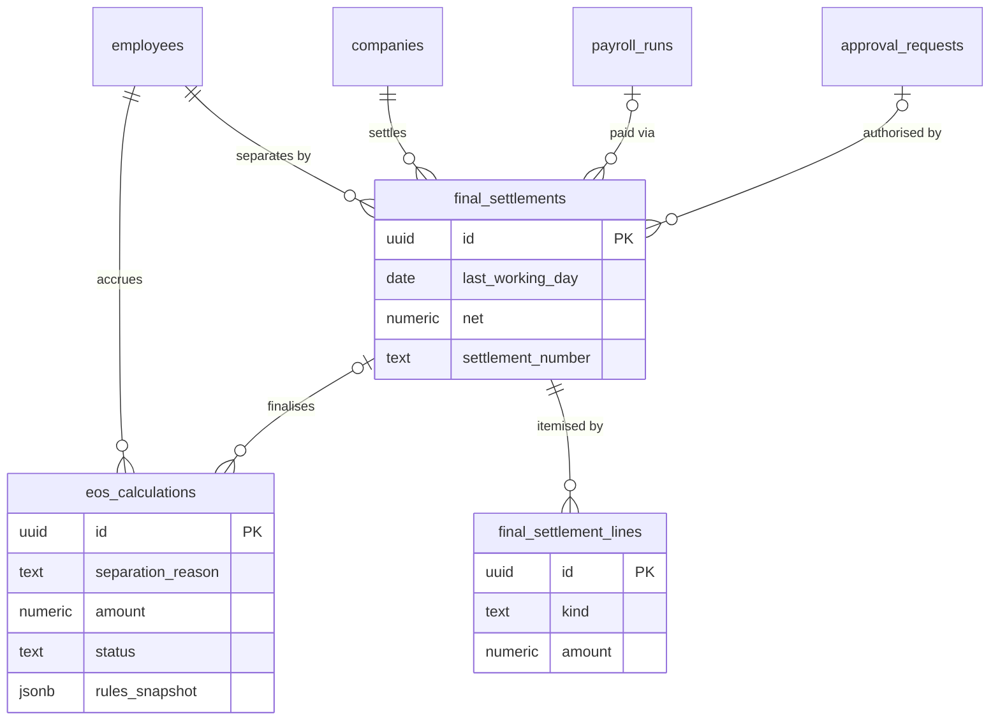
```mermaid
erDiagram
    employees ||--o{ eos_calculations : "accrues"
    final_settlements |o--o{ eos_calculations : "finalises"
    employees ||--o{ final_settlements : "separates by"
    companies ||--o{ final_settlements : "settles"
    final_settlements ||--o{ final_settlement_lines : "itemised by"
    payroll_runs |o--o{ final_settlements : "paid via"
    approval_requests |o--o{ final_settlements : "authorised by"

    eos_calculations {
        uuid id PK
        text separation_reason
        numeric amount
        text status
        jsonb rules_snapshot
    }
    final_settlements {
        uuid id PK
        date last_working_day
        numeric net
        text settlement_number
    }
    final_settlement_lines {
        uuid id PK
        text kind
        numeric amount
    }
```

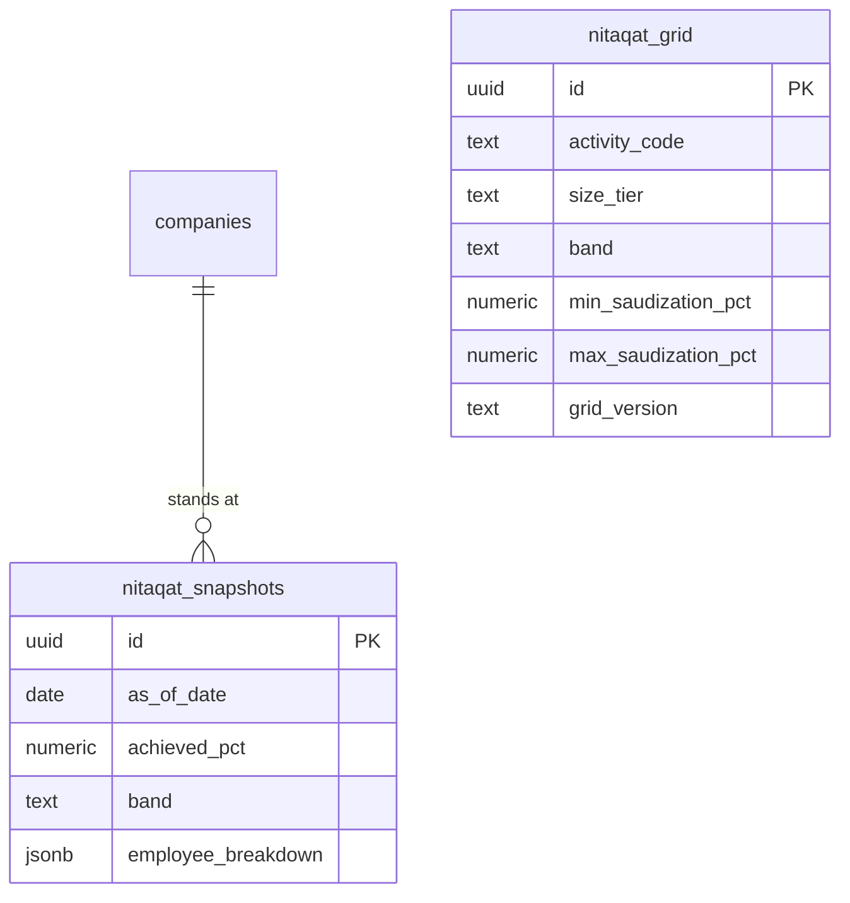
```mermaid
erDiagram
    companies ||--o{ nitaqat_snapshots : "stands at"

    nitaqat_grid {
        uuid id PK
        text activity_code
        text size_tier
        text band
        numeric min_saudization_pct
        numeric max_saudization_pct
        text grid_version
    }
    nitaqat_snapshots {
        uuid id PK
        date as_of_date
        numeric achieved_pct
        text band
        jsonb employee_breakdown
    }
```

`nitaqat_grid` is reference data joined from `companies.nitaqat_activity_code` by **text code, not
an FK** — the grid is versioned and a company's activity is a property of the company.

`nitaqat_snapshots.employee_breakdown` holds employee ids inside JSON, where no composite FK can
reach them. That is the drill-down behind the KPI, and it is also
`TARGET_SCHEMA.md` §6 Risk 3 — the purge job must cover it explicitly.

---

## N. GOSI registration and filing

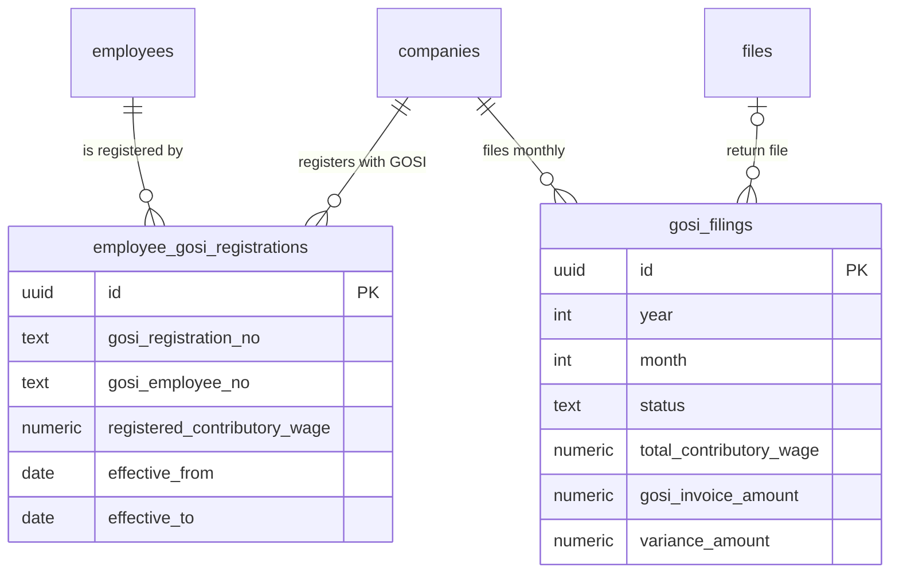
```mermaid
erDiagram
    employees ||--o{ employee_gosi_registrations : "is registered by"
    companies ||--o{ employee_gosi_registrations : "registers with GOSI"
    companies ||--o{ gosi_filings : "files monthly"
    files |o--o{ gosi_filings : "return file"

    employee_gosi_registrations {
        uuid id PK
        text gosi_registration_no
        text gosi_employee_no
        numeric registered_contributory_wage
        date effective_from
        date effective_to
    }
    gosi_filings {
        uuid id PK
        int year
        int month
        text status
        numeric total_contributory_wage
        numeric gosi_invoice_amount
        numeric variance_amount
    }
```

These two exist because **GOSI invoices against the wage GOSI holds, not the wage payroll
computes**. `registered_contributory_wage` is what GOSI has on file; `gosi_filings.variance_amount`
forces every difference from the GOSI invoice to be explained rather than absorbed.

`gosi_filings` has **no FK to `payroll_runs`** — the link runs the other way, through
`payroll_slips.employer_gosi_registration_no`, which ties each slip to the establishment whose
return carried it.

---

## O. Approvals, and P. Notifications

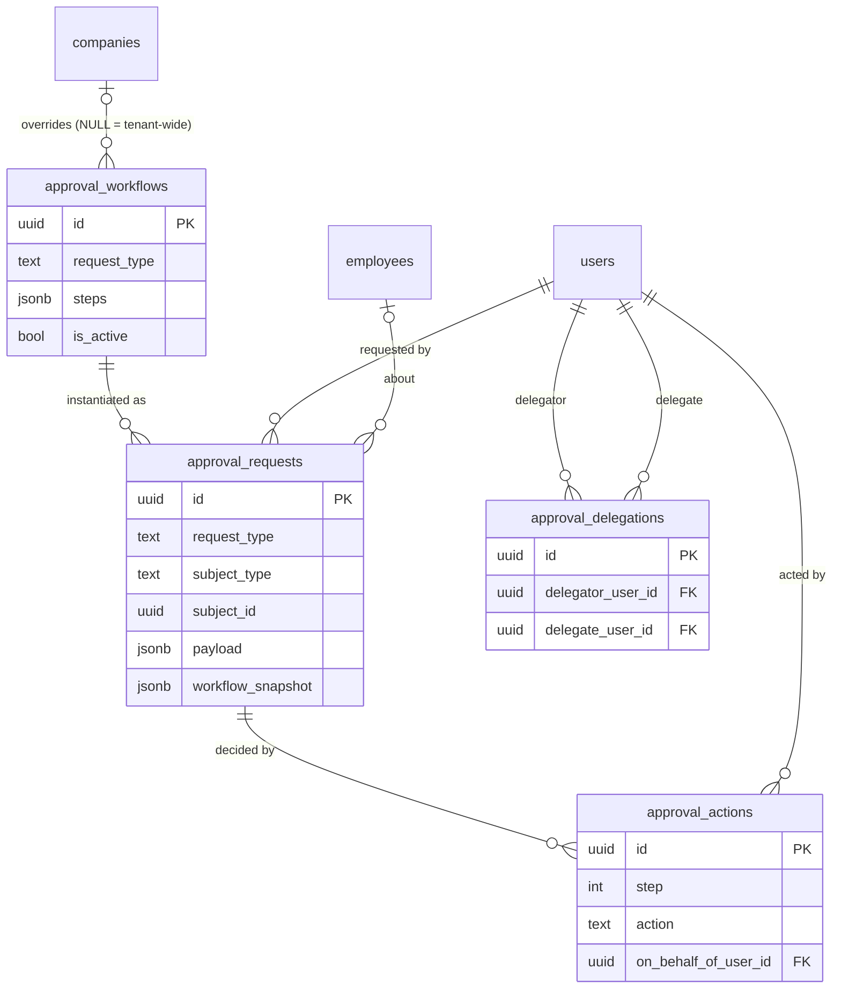
```mermaid
erDiagram
    approval_workflows ||--o{ approval_requests : "instantiated as"
    approval_requests ||--o{ approval_actions : "decided by"
    users ||--o{ approval_requests : "requested by"
    users ||--o{ approval_actions : "acted by"
    users ||--o{ approval_delegations : "delegator"
    users ||--o{ approval_delegations : "delegate"
    employees |o--o{ approval_requests : "about"
    companies |o--o{ approval_workflows : "overrides (NULL = tenant-wide)"

    approval_workflows {
        uuid id PK
        text request_type
        jsonb steps
        bool is_active
    }
    approval_requests {
        uuid id PK
        text request_type
        text subject_type
        uuid subject_id
        jsonb payload
        jsonb workflow_snapshot
    }
    approval_actions {
        uuid id PK
        int step
        text action
        uuid on_behalf_of_user_id FK
    }
    approval_delegations {
        uuid id PK
        uuid delegator_user_id FK
        uuid delegate_user_id FK
    }
```

**`approval_requests` is referenced by ten tables across seven domains** (assignments, salaries,
loans, leave requests, overtime, timesheets, punches, payroll runs, final settlements). Adding an
approvable thing means adding a `request_type` **value** — never a table. The previous schema had
17 approval tables; this has four.

`approval_requests.subject_id` is a **polymorphic pointer with no FK**. It is the one place the
composite-FK tenancy guarantee does not reach, and it needs a CHECK plus RLS.

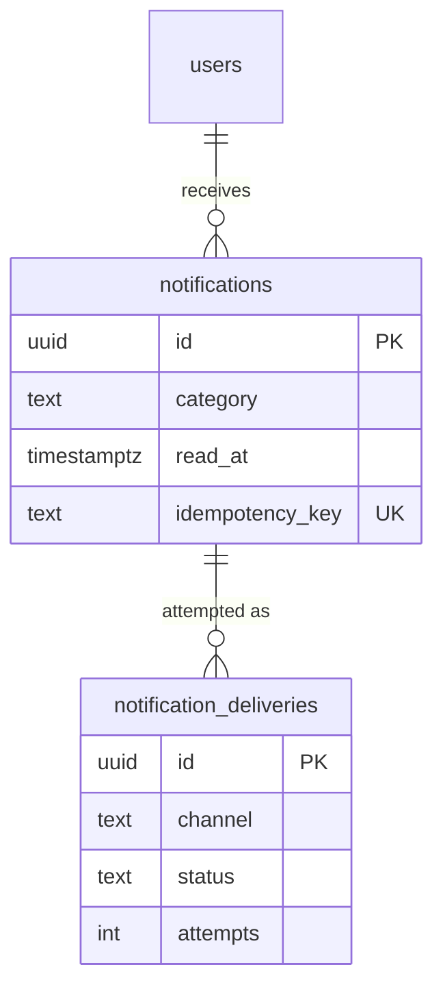
```mermaid
erDiagram
    users ||--o{ notifications : "receives"
    notifications ||--o{ notification_deliveries : "attempted as"

    notifications {
        uuid id PK
        text category
        timestamptz read_at
        text idempotency_key UK
    }
    notification_deliveries {
        uuid id PK
        text channel
        text status
        int attempts
    }
```

---

## Q. Audit, and R. Jobs

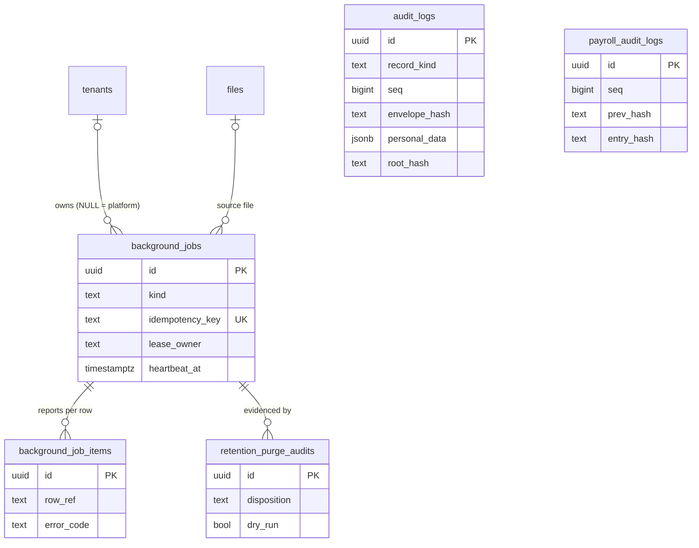
```mermaid
erDiagram
    background_jobs ||--o{ background_job_items : "reports per row"
    background_jobs ||--o{ retention_purge_audits : "evidenced by"
    tenants |o--o{ background_jobs : "owns (NULL = platform)"
    files |o--o{ background_jobs : "source file"

    audit_logs {
        uuid id PK
        text record_kind
        bigint seq
        text envelope_hash
        jsonb personal_data
        text root_hash
    }
    payroll_audit_logs {
        uuid id PK
        bigint seq
        text prev_hash
        text entry_hash
    }
    retention_purge_audits {
        uuid id PK
        text disposition
        bool dry_run
    }
    background_jobs {
        uuid id PK
        text kind
        text idempotency_key UK
        text lease_owner
        timestamptz heartbeat_at
    }
    background_job_items {
        uuid id PK
        text row_ref
        text error_code
    }
```

**`audit_logs` and `payroll_audit_logs` have no foreign keys, deliberately.** An audit row must
still be readable after the employee, the run or the tenant row it describes has been purged. That
is why `entity`/`entity_id` are plain columns and `personal_data` is a separable, nullable payload.

The two use different integrity schemes on purpose: `audit_logs` is checkpointed (Merkle root over
a `seq` range, because a per-row chain would serialise every login behind one hot row);
`payroll_audit_logs` is row-chained (low write rate, highest evidentiary bar) and its existing
`trg_payroll_audit_logs_append_only` trigger is carried into the baseline unchanged.

---

## Row-level security, as a picture

Every table in every diagram above falls into exactly one of **six** populations (§19.2), and they
sum to exactly 76 — revision 6's "three shapes" counted 66 + 6 + 4 = 76 while separately putting
`platform_users` outside all of them, which is 77. This is the map of which:

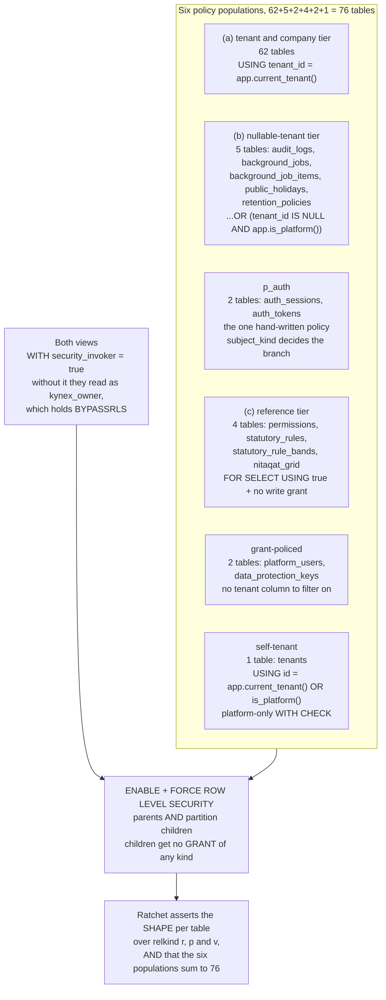
```mermaid
flowchart TB
    subgraph Shapes["Six policy populations, 62+5+2+4+2+1 = 76 tables"]
        A["(a) tenant and company tier<br/>62 tables<br/>USING tenant_id = app.current_tenant()"]
        B["(b) nullable-tenant tier<br/>5 tables: audit_logs, background_jobs,<br/>background_job_items, public_holidays,<br/>retention_policies<br/>...OR (tenant_id IS NULL AND app.is_platform())"]
        E["p_auth<br/>2 tables: auth_sessions, auth_tokens<br/>the one hand-written policy<br/>subject_kind decides the branch"]
        C["(c) reference tier<br/>4 tables: permissions, statutory_rules,<br/>statutory_rule_bands, nitaqat_grid<br/>FOR SELECT USING true + no write grant"]
        D["grant-policed<br/>2 tables: platform_users,<br/>data_protection_keys<br/>no tenant column to filter on"]
        T["self-tenant<br/>1 table: tenants<br/>USING id = app.current_tenant() OR is_platform()<br/>platform-only WITH CHECK"]
    end

    V["Both views<br/>WITH security_invoker = true<br/>without it they read as kynex_owner,<br/>which holds BYPASSRLS"]

    Shapes --> F["ENABLE + FORCE ROW LEVEL SECURITY<br/>parents AND partition children<br/>children get no GRANT of any kind"]
    V --> F
    F --> G["Ratchet asserts the SHAPE per table<br/>over relkind r, p and v,<br/>AND that the six populations sum to 76"]
```

**`tenants` cannot express shape (a) at all.** It has no `tenant_id` — it *is* the tenant — so the
predicate is on its own key, and its `WITH CHECK` is platform-only: a tenant session may read its own
row and must never create or re-key one.

**`data_protection_keys` is in no shape, deliberately.** The ASP.NET Data Protection key ring is
**deployment-wide**: every tenant's payloads are protected by the same ring, so there is nothing to
filter on and filtering it would break decryption. Grant plus the `xml` column revoke is the control.

**Two tables are shape (b) because the alternative is a *silent failure*, not a leak** — and this
pattern has now appeared twice, which is why it is drawn rather than described. `retention_policies`
carries its platform DEFAULT rows as `tenant_id IS NULL`; under (a) a tenant session sees only its own
override rows and the retention engine runs **with overrides and no defaults at all**.
`background_job_items` inherits its job's NULL tenant; under (a) **the worker draining a platform
queue cannot see its own items**, and the import reports zero rows processed and zero errors. In both
the wrong shape makes the table look *empty* rather than *wrong*. That is why the ratchet asserts the
*shape* per table, and the arithmetic — a table with RLS enabled and the wrong policy is as wrong as
a table with none.

**Views are in scope, and this was a P0.** `v_leave_balances` is the only sanctioned way to read a
leave balance — and a view without `security_invoker` evaluates its base tables as the view owner,
which holds `BYPASSRLS`. The mandated read path was a cross-tenant leak by default.

**Shape (c) is the one that pays for itself.** Reference data stops being filtered, so reading a
statutory rule stops needing a bypass — which removes the largest bypass category outright rather
than auditing it.

**Fail-closed is the property to remember:** with `app.tenant_id` unset,
`tenant_id = app.current_tenant()` is NULL, no row is visible, and every INSERT raises `42501`. A
misconfigured request returns empty or errors. It never returns another tenant's data.

---

## Diagram maintenance

These diagrams are **generated**, not drawn. See `KEEPING_DOCS_HONEST.md`: the relationships come
from the EF model, and CI fails when a model edge has no matching diagram edge. Do not hand-edit
an `erDiagram` block — regenerate it.

Prose between the diagrams is hand-maintained and is **not** checked by CI. It is where the
"why" lives, and it is the part most worth reading.
